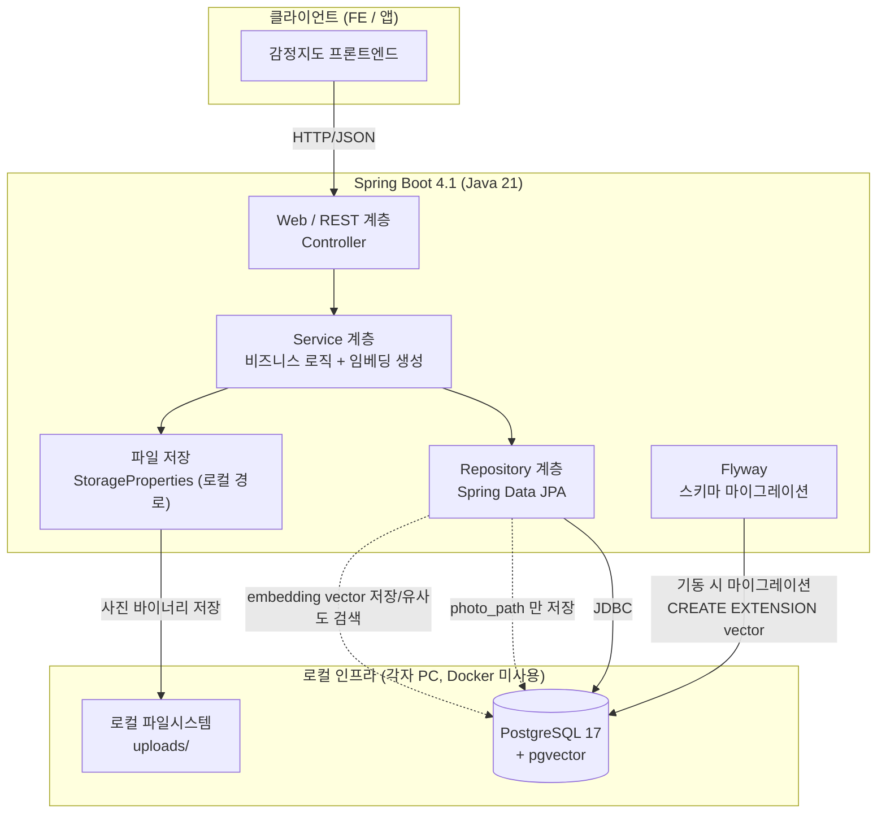
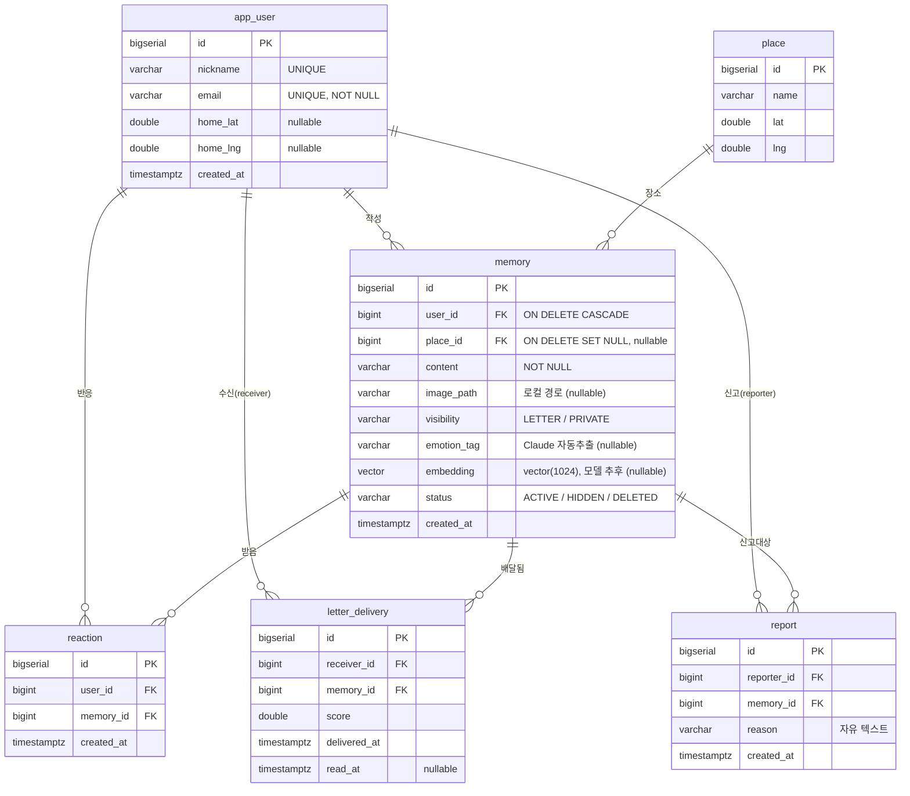
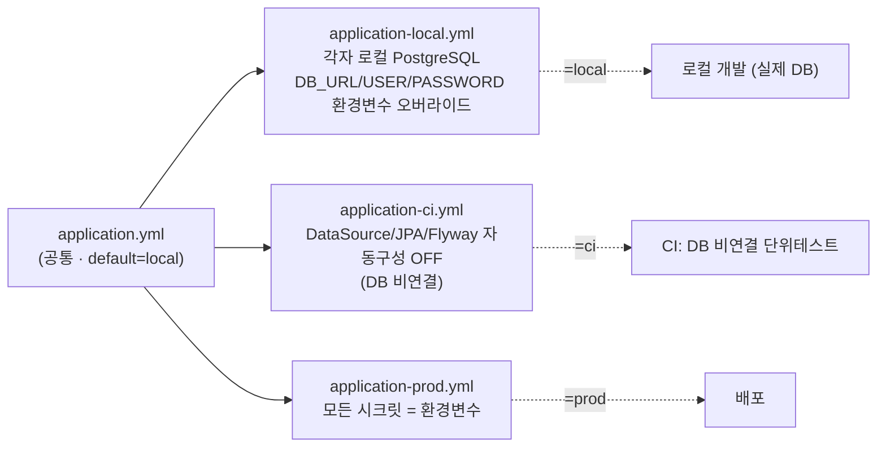
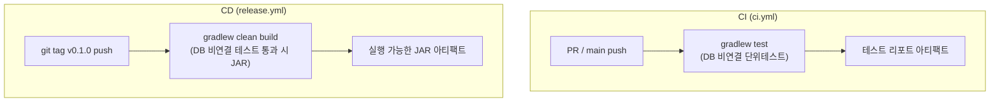
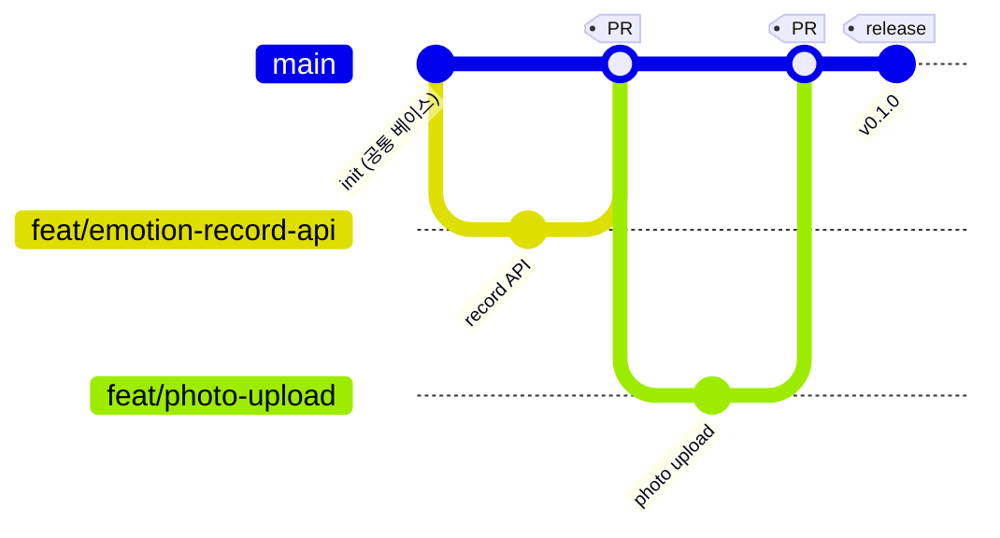
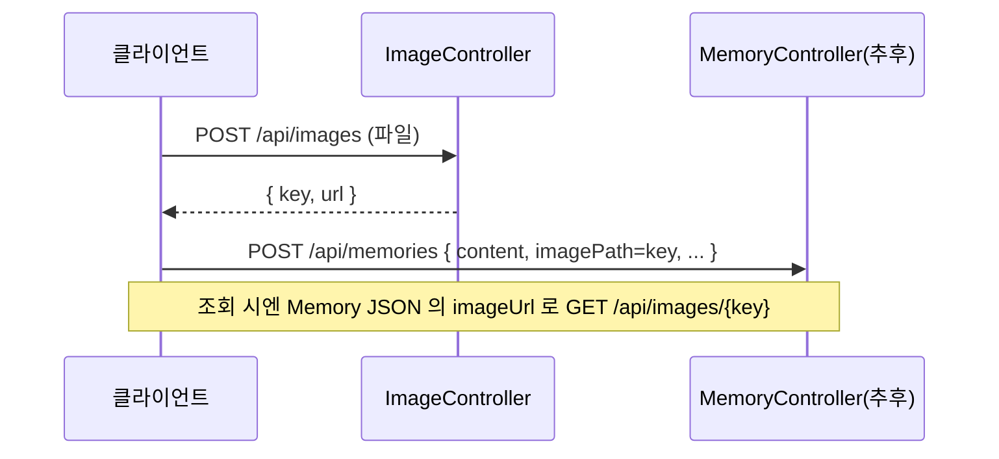
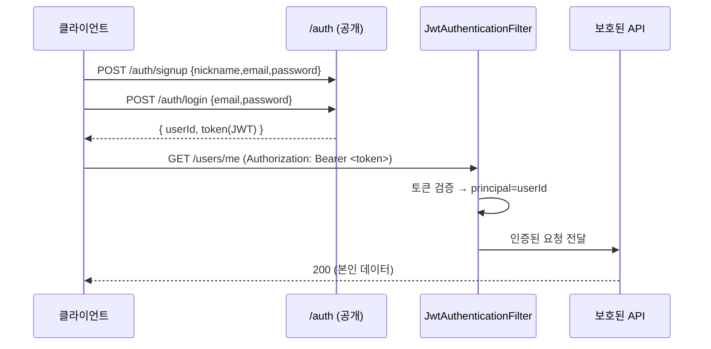

# 감정지도 백엔드 아키텍처

Spring Boot 4.1 · Java 21 (LTS) · PostgreSQL 17 + pgvector · Gradle Wrapper 9.0 (Kotlin DSL) · Flyway

> 이 모듈들은 백엔드 팀이 처음 함께 시작하는 **공통 베이스**입니다.

---

## 1. 확정된 공통 스택

| 항목 | 값 | 고정 방법 |
|------|-----|-----------|
| Java | 21 (LTS) | `build.gradle.kts` toolchain 으로 강제 |
| Spring Boot | 4.1.0 | `build.gradle.kts` 플러그인 버전 |
| Gradle | 9.0.0 / **Kotlin DSL** | `gradle/wrapper/` 로 고정, 스크립트는 `*.gradle.kts` |
| PostgreSQL | 17 + **pgvector** | **각자 로컬에 직접 설치** (Docker 미사용) |
| 벡터 검색 | pgvector `vector` 타입 (JPA 매핑은 **hibernate-vector**) | Flyway 로 `CREATE EXTENSION vector` |
| 보일러플레이트 | **Lombok** (@Getter/@Builder/@RequiredArgsConstructor 등) | `build.gradle.kts` + `lombok.config` |
| API 문서 | **springdoc-openapi 3.1.x** (Swagger UI) | `/swagger-ui.html`, `/v3/api-docs` (자동 생성) |
| 인증/인가 | **Spring Security + JWT** (jjwt 0.13.x) | signup/login 만 공개, 그 외 Bearer 토큰 필요 |
| DB 마이그레이션 | Flyway | `src/main/resources/db/migration/` |
| 패키지 루트 | `team4.emotionmap` | — |
| 컬럼 네이밍 | snake_case | Hibernate `CamelCaseToUnderscoresNamingStrategy` |

핵심 정책:
- **Docker 사용 안 함.** 각자 자기 PC 에 PostgreSQL 17 + pgvector 를 직접 설치.
- **DB 데이터/스키마를 GitHub(원격)에 올리지 않는다.** CI 는 DB 에 연결하지 않고 컴파일 + DB 비연결 단위테스트만 수행.
- DB 가 필요한 통합테스트는 **각자 로컬에서만** 수동 수행.

> 스택 검증: Spring Boot 4.1 은 2026-06-10 정식 릴리스(최신 안정판), Java 21 호환.
> pgvector 자바 클라이언트 `com.pgvector:pgvector:0.1.6` 은 Maven Central 에 존재.

---

## 2. 저장소 구조 (백엔드 전용 레포)

이 레포는 백엔드 전용이다(`KOSSCCHTHON-Team4/Backend`). 프로젝트 루트 = 레포 루트.
프론트엔드/AI 는 각각 별도 레포(`Frontend`, `AI`)에 있다.

```text
Backend/                          ← 레포 루트 = Gradle 프로젝트 루트
├── .github/workflows/
│   ├── ci.yml                    # PR·push -> DB 비연결 단위테스트
│   └── release.yml               # v* 태그 -> JAR 빌드 (DB 비연결)
├── .gitignore
├── build.gradle.kts              # (Kotlin DSL) Java21 · SpringBoot4.1 · pgvector · Lombok · Security
├── settings.gradle.kts           # rootProject = emotion-map
├── lombok.config                 # Lombok 공통 설정 (팀 동일 동작)
├── gradlew / gradlew.bat         # Gradle Wrapper (팀 전원 동일 버전 보장)
├── gradle/wrapper/               # wrapper JAR + properties (커밋함)
├── ARCHITECTURE.md               # (이 문서)
├── CLAUDE.md
├── src/main/java/team4/emotionmap/
│   ├── EmotionMapApplication.java
│   ├── account/                       # 회원가입·로그인·프로필, app_user 소유
│   │   ├── User.java / UserRepository.java
│   │   ├── AuthService.java / AuthController.java
│   │   ├── UserService.java / UserController.java
│   │   └── dto/                       # 인증·프로필 요청/응답
│   ├── memory/                        # 기억 상태·공개 범위·조회, memory 소유
│   │   ├── Memory.java / MemoryRepository.java / MemoryService.java
│   │   ├── Emotion.java / Visibility.java / MemoryStatus.java
│   │   ├── MemoryController.java      # POST/GET/DELETE /memories
│   │   ├── PlaceMemoryController.java # GET /places/{id}/memories
│   │   ├── dto/                       # MemoryCreateRequest / MemoryResponse
│   │   ├── reaction/                  # 기억의 하위 기능, reaction 소유
│   │   │   ├── Reaction.java / ReactionRepository.java / ReactionService.java
│   │   │   ├── ReactionController.java # POST /memories/{id}/reactions
│   │   │   └── dto/                   # ReactionResponse
│   │   └── ai/                        # 기억이 사용하는 포트, 구현은 추후
│   │       ├── ContentModerator.java / EmotionTagger.java / Embedder.java
│   │       └── EmbeddingProperties.java # app.embedding.* 바인딩
│   ├── place/                         # 장소·지도 영역 조회, place 소유
│   │   ├── Place.java / PlaceRepository.java / PlaceService.java
│   │   ├── PlaceController.java       # GET /places?bbox=
│   │   └── dto/                       # PlaceResponse
│   ├── letter/                        # 수신 목록·읽음 상태, letter_delivery 소유
│   │   ├── LetterDelivery.java / LetterDeliveryRepository.java / LetterService.java
│   │   ├── LetterController.java      # GET /letters, PATCH /letters/{id}/read
│   │   └── dto/                       # LetterResponse
│   ├── report/                        # 신고 접수, report 소유
│   │   ├── Report.java / ReportRepository.java / ReportService.java
│   │   ├── ReportController.java      # POST /reports
│   │   └── dto/                       # ReportCreateRequest / ReportResponse
│   ├── media/                         # 이미지 업로드·조회, 엔티티 없는 기능 모듈
│   │   ├── ImageController.java / ImageStorageService.java
│   │   ├── StorageProperties.java     # app.storage.* 바인딩
│   │   ├── StoredImage.java / InvalidUploadException.java / ImageNotFoundException.java
│   │   └── dto/                       # ImageUploadResponse
│   └── platform/                      # 업무 모듈에 의존하지 않는 기술 지원
│       ├── security/
│       │   ├── SecurityConfig.java / JwtAuthenticationFilter.java
│       │   └── JwtTokenProvider.java / JwtProperties.java
│       └── openapi/OpenApiConfig.java # OpenAPI 메타데이터 + JWT Bearer 스킴
├── src/main/resources/
│   ├── application.yml               # 공통 (default profile = local)
│   ├── application-local.yml         # 로컬 PostgreSQL, 환경변수 오버라이드
│   ├── application-ci.yml            # DB 비연결 테스트용, 앱 부팅용 아님
│   ├── application-prod.yml          # 배포 (시크릿 = 환경변수)
│   └── db/migration/V1__init.sql      # 중앙 Flyway 이력 유지
└── src/test/java/team4/emotionmap/
    ├── architecture/ModuleArchitectureTest.java # DB 비연결 모듈 경계 검사
    └── platform/security/JwtTokenProviderTest.java # JWT 발급·검증
```

> Docker 를 쓰지 않으므로 `docker-compose.yml` 은 없다. 백엔드 명령은 레포 루트에서 실행한다.

### 2-1. 모듈 경계와 의존성 규칙

- **단일 Gradle 모듈 안에서 업무 기능별 패키지로 나눈다.** 각 기능이 Entity·Repository·
  Service·Controller·DTO를 함께 소유하며, 작은 기능에 계층별 하위 폴더를 반복하지 않는다.
- `account`는 인증과 프로필이 공유하는 사용자 데이터를 소유한다. `memory.reaction`은
  별도 최상위 모듈이 아니라 기억의 하위 기능이다. 이것이 두 엔티티의 합병이나
  JPA 연관관계 추가를 의미하지는 않는다.
- **URL 계층과 코드 소유권은 별개다.** `/places/{id}/memories`는 기억 조회이므로
  `memory.PlaceMemoryController`가 소유한다. 장소 모듈이 기억 서비스에 의존하지 않는다.
- 현재 허용하는 모듈 간 직접 의존성은 **`account` → `platform.security.JwtTokenProvider`**
  하나다. Java 타입이 `public`이라고 해서 다른 모듈에 공개된 계약은 아니다.
- 다른 모듈의 Entity·Repository·내부 Service·DTO를 직접 참조하지 않는다. 새 협업이
  필요하면 소유 모듈의 제한된 공개 API를 먼저 정의하고, 해당 계약만 경계 테스트에
  명시적으로 허용한다. 인터페이스·Facade를 호출자 없이 미리 만들지 않는다.
- 모듈 사이에는 ID와 필요한 결과를 전달한다. 신고 처리에서 기억을 숨겨야 한다면
  기억 모듈의 기능을 호출하며, 신고 모듈이 기억 저장소에 직접 접근하지 않는다.
- `platform`은 업무 모듈에 역으로 의존하지 않는다. 설정은 소유 기능과 함께 둔다:
  저장소 설정은 `media`, 임베딩 설정은 `memory.ai`, JWT 설정은 `platform.security`.
- `ModuleArchitectureTest`가 선언된 패키지 소속, 허용한 공개 계약 외 접근 금지,
  모듈 간 순환 금지를 검사한다. `./gradlew test`로 실행하며 DB는 필요 없다.
- **패키지 경계는 DB의 독립성을 뜻하지 않는다.** FK와 삭제 전파 정책은 §4와
  Flyway에 그대로 남는다. 기억 삭제가 반응·배달·신고를 함께 삭제하는 생명주기를
  변경할 때는 관련 모듈의 정책도 함께 검토한다.
- 이번 재배치는 URL·JSON·테이블·환경변수 이름을 유지한다. 인증·객체별 인가 정책이나
  AI 구현의 유무도 변경하지 않는다.

---

## 3. 시스템 구성도



원칙:
- **사진 바이너리는 로컬 파일시스템(`uploads/`)에 저장, DB 에는 경로(`photo_path`)만 기록.**
- **감정 임베딩은 pgvector `vector` 타입으로 저장**해 코사인 유사도 검색(HNSW 인덱스) 지원.

---

## 4. 데이터 모델 (ERD: User / Place / Memory / Reaction / LetterDelivery / Report)



핵심 규칙:
- **감정 태그(`emotion_tag`)는 서버가 `content` 에서 Claude(sonnet-5)로 자동 추출**해 채운다.
  API 요청에서 감정을 직접 받지 않는다. 추출 전에는 null.
- **임베딩(`embedding vector(1024)`)은 별도 임베딩 모델**(Voyage 등, 추후 확정)로 생성해 채운다.
  Claude 는 임베딩 모델이 아니므로(공식 문서 명시) 임베딩에 쓸 수 없다. 생성 전에는 null.
  유사도 검색용 HNSW 인덱스(`vector_cosine_ops`)를 함께 생성.
- 임베딩 모델/키는 yml 에 하드코딩하지 않는다. `app.embedding.*` placeholder + 환경변수
  (`EMBEDDING_*`, `EMBEDDING_API_KEY`)로 추후 주입.
- `reaction` 은 `(user_id, memory_id)` UNIQUE (중복 반응 불가). `report` 는 중복 허용.
- Memory 삭제 시 하위 `reaction`/`letter_delivery`/`report` 는 `ON DELETE CASCADE`.
  소프트 삭제는 `status = DELETED` 로 표시.

---

## 5. 프로필 전략

파일 구조는 저장소에 **통일**해 두고 값만 프로필별로 나눕니다.
실행 프로필은 `SPRING_PROFILES_ACTIVE` 로 전환합니다(미지정 시 `local`).



- **local**: 각자 로컬 PostgreSQL 접속. 접속 정보가 다르면 `DB_URL`/`DB_USERNAME`/`DB_PASSWORD` 환경변수로 오버라이드.
- **ci**: DataSource·JPA·Flyway 자동구성을 비활성화해 DB 없이도 컨텍스트/단위테스트가 뜨게 함.
- **prod**: 비밀값은 파일에 없고 환경변수만 참조 → 파일 커밋 안전.

---

## 6. CI / CD (DB 비연결)



- CI/CD 어디에서도 DB 를 띄우거나 연결하지 않는다(DB 데이터/스키마 원격 업로드 금지 정책).
- DB 가 필요한 통합테스트는 각자 로컬에서만 수행.

---

## 7. 로컬 준비 (Docker 미사용)

### 7-1. PostgreSQL 17 + pgvector 설치 (macOS 예시)

```bash
# PostgreSQL 17 설치 및 기동
brew install postgresql@17
brew services start postgresql@17

# pgvector 확장 설치
brew install pgvector
```

Ubuntu/Debian:

```bash
sudo apt install postgresql-17 postgresql-17-pgvector
```

> Flyway 가 `CREATE EXTENSION IF NOT EXISTS vector` 를 실행하므로, pgvector 바이너리는
> DB 서버에 설치돼 있어야 한다(확장 활성화는 마이그레이션이 자동 수행).

### 7-2. DB / 계정 생성

```bash
psql -d postgres -c "CREATE USER emotionmap WITH PASSWORD 'emotionmap';"
psql -d postgres -c "CREATE DATABASE emotionmap OWNER emotionmap;"
```

### 7-3. 실행

```bash
# 레포 루트에서 실행 (백엔드 전용 레포)
./gradlew bootRun                       # 기본 프로필 = local
curl http://localhost:8080/actuator/health

./gradlew test                          # DB 비연결 단위테스트 (Docker/DB 불필요)

git tag v0.1.0 && git push origin v0.1.0
```

---

## 8. 팀 합의 규칙

- **DB 데이터/스키마를 GitHub 에 올리지 않는다.** 덤프(`*.dump`, `*.sql.gz`, `*.csv` 등)는 `.gitignore` 로 차단. (스키마 형상관리인 Flyway 마이그레이션 `.sql` 은 코드이므로 커밋)
- **Docker 미사용.** 각자 로컬에 PostgreSQL 17 + pgvector 직접 설치.
- **Flyway 마이그레이션**: 파일명 양식과 번호 분담 규칙은 아래 **9. Flyway 마이그레이션 작성 양식** 참고.
- **임베딩 모델은 미확정**이다. yml 에 모델/키를 하드코딩하지 않고 `app.embedding.*`
  placeholder 만 둔다. 모델 확정 시: `EMBEDDING_*` 환경변수로 값 주입(`EMBEDDING_API_KEY`는
  커밋 금지) + `vector(N)` 차원을 새 마이그레이션으로 맞춘다.
- **컬럼 네이밍**: snake_case (설정으로 강제).
- **시크릿**: 커밋 금지. prod 는 환경변수만.
- **브랜치**: main 보호 + feature 브랜치 + PR. 상세는 아래 **10. 브랜치 전략** 참고.

---

## 9. Flyway 마이그레이션 작성 양식

### 9-1. 파일 위치

```
src/main/resources/db/migration/
```
Flyway 가 이 디렉토리의 파일을 버전 순서대로 자동 적용한다.

### 9-2. 파일명 규칙

```
V{버전}__{설명}.sql
```

- `V` : 버전 마이그레이션 접두사 (대문자 V)
- `{버전}` : 정수 또는 점 구분 버전 (예: `2`, `2.1`). 우리는 정수 사용.
- `__` : **더블 언더스코어** (버전과 설명 구분자). 하나(`_`)면 안 된다.
- `{설명}` : 무엇을 하는지. **snake_case**(단어는 `_` 로 구분). 소문자 권장.
- 확장자 `.sql`

올바른 예:
```
V2__add_emotion_tag_column.sql
V3__create_comment_table.sql
V4__create_index_on_recorded_at.sql
```
잘못된 예:
```
V2_add_tag.sql          # 언더스코어 1개 (X)
v2__add_tag.sql         # 소문자 v (X)
V2 add tag.sql          # 공백 (X)
2__add_tag.sql          # V 접두사 없음 (X)
```

### 9-3. 번호 충돌 방지 — 담당별 번호 분담

### 9-3. 번호 충돌 방지 — "만들기 전 pull, 겹치면 리네임"

두 명이 우연히 같은 번호로 각자 커밋한 걸 머지할 때만 충돌이 난다. 해커톤 규모에선
드물고, 나더라도 사소하다. 홀짝 분담 같은 상시 규칙은 두지 않고 아래 습관으로 충분하다.

1. **새 마이그레이션 만들기 전 `git switch main && git pull`** → 현재 최고 번호 확인 후 +1.
2. **작게 자주 머지** → main 에 항상 최신 번호가 반영돼 다음 번호가 헷갈리지 않는다.
3. **그래도 겹치면**: 나중에 머지되는 쪽이 파일명 번호만 바꾼다 (`V2__...` → `V3__...`).
   Flyway 는 파일명만 리네임하면 되고, 아직 로컬 DB 에만 적용된 상태라면
   `./gradlew flywayClean`(또는 DB 재생성) 후 다시 적용하면 된다.

> `V1__init.sql` 이 공통 베이스다. 다음 새 마이그레이션은 누구든 `V2__...` 부터 시작한다.

### 9-4. 절대 규칙

- **이미 적용된(=someone 이 실행한/머지된) 마이그레이션 파일은 절대 수정하지 않는다.**
  Flyway 는 파일 내용의 checksum 을 기록하므로, 수정하면 다른 사람의 DB 에서 마이그레이션이
  깨진다. 잘못됐으면 **새 버전 파일을 추가**해 고친다.
- 하나의 마이그레이션은 **하나의 논리적 변경**만. (테이블 추가와 무관한 인덱스 변경을 섞지 않기)
- DDL 위주로 작성한다. 실제 "데이터"(개인정보 포함 가능)는 마이그레이션에 넣지 않는다.

---

## 10. 브랜치 전략

경량 GitHub Flow. **사람별 브랜치가 아니라 작업(기능)별 브랜치 + PR** 로 간다.



규칙:
1. **`main` 은 항상 배포 가능 상태.** 직접 push 금지, PR 로만 병합. CI(`ci.yml`) 통과 필수.
2. **브랜치는 작업 단위로 짧게.** 이름은 사람이 아니라 하는 일로 짓는다:
   - `feat/{기능}` · `fix/{버그}` · `chore/{잡일}` · `refactor/{대상}`
   - 예: `feat/emotion-record-api`, `fix/flyway-v3`, `chore/ci-cache`
3. **작게 자주 머지** (하루 안에 끝날 크기). 머지 후 브랜치 삭제.
4. 새 작업 시작 전 `git switch main && git pull` 로 최신화 후 브랜치 생성.

전형적인 흐름:
```bash
git switch main && git pull
git switch -c feat/emotion-record-api
# ... 코드 작성 & 커밋 ...
git push -u origin feat/emotion-record-api
# GitHub 에서 PR 생성 -> 상대 리뷰 -> main 으로 머지 -> 브랜치 삭제
```

권장 GitHub 설정 (repo Settings):
- `main` branch protection: PR 필수 + `ci.yml` status check 필수
- "Automatically delete head branches" 켜기 (머지된 브랜치 자동 정리)

---

## 11. 코딩 컨벤션 (Lombok · JPA 엔티티 · pgvector)

기존 기능 패키지의 Entity·Repository·Service·Controller·DTO 패턴을 재사용한다.
새 기능의 소유 모듈을 먼저 정하고, 새 최상위 모듈이면 §2-1의 경계 검사에도 등록한다.

### 11-1. Lombok

- 설정은 `lombok.config` (레포 루트)에 통일(팀 전원 동일 동작).
- **엔티티**: `@Getter` + `@NoArgsConstructor(access = PROTECTED)` + `@Builder` 조합만 사용.
  `@Setter` / `@Data` / 전체 `@ToString` / `@EqualsAndHashCode` 는 **쓰지 않는다**
  (무분별한 상태 변경, 연관관계 순환/지연로딩 문제 방지).
- **스프링 빈(Service/Component)**: `@RequiredArgsConstructor` 로 `final` 필드 생성자 주입.
  필드 주입(`@Autowired`) 금지. 로깅은 `@Slf4j`.
- **DTO**: Java `record` 를 기본으로(불변). Lombok 불필요.

### 11-2. JPA 엔티티

- 테이블/컬럼은 Flyway 가 만든 스키마와 일치시킨다. 컬럼명은 snake_case(자동 변환).
- `ddl-auto: validate` 이므로 엔티티와 스키마가 어긋나면 부팅이 실패한다(의도된 안전장치).
- ID 는 `@GeneratedValue(strategy = IDENTITY)` (PostgreSQL BIGSERIAL).

### 11-3. pgvector 매핑 (중요)

JPA 에서 `vector` 컬럼은 **hibernate-vector** 모듈로 매핑한다
(JDBC 전용 `com.pgvector:pgvector` 아님).

```java
import org.hibernate.annotations.Array;
import org.hibernate.annotations.JdbcTypeCode;
import org.hibernate.type.SqlTypes;

@JdbcTypeCode(SqlTypes.VECTOR)
@Array(length = 1024)                       // DB 의 vector(N) 과 반드시 일치
@Column(columnDefinition = "vector(1024)")
private float[] embedding;
```

- 차원 상수는 `Memory.EMBEDDING_DIMENSION` (현재 1024). 모델 변경 시
  이 값 + `@Array(length=...)` + Flyway `vector(N)` 을 **함께** 바꾼다.
- **유사도 검색은 native query** 로. JPQL 은 pgvector 연산자를 모른다.
  연산자: `<=>` 코사인, `<->` L2, `<#>` 내적. V1 인덱스가 `vector_cosine_ops` 라 `<=>` 사용.

```java
@Query(value = """
        SELECT * FROM memory
        WHERE embedding IS NOT NULL
          AND status = 'ACTIVE'
        ORDER BY embedding <=> :embedding
        LIMIT :limit
        """, nativeQuery = true)
List<Memory> findNearestByEmbedding(@Param("embedding") float[] embedding,
                                    @Param("limit") int limit);
```

> 드라이버가 캐스팅을 요구하면 `... <=> CAST(:embedding AS vector) ...` 로 바꾼다.

### 11-4. 감정 태그 · 임베딩 채우기 (AI 포트)

- `emotion_tag` 와 `embedding` 은 **API 요청에서 받지 않고 서버가 채운다**.
- `memory/ai/EmotionTagger` (Claude 구현 예정) 가 `content` → 감정 태그를 추출한다.
- `memory/ai/Embedder` (Voyage 등 구현 예정) 가 `content` → 임베딩 벡터를 생성한다.
- 두 포트는 **아직 구현 빈이 없다.** `MemoryService` 는 `Optional<...>` 로 주입받아,
  구현이 등록되면 자동으로 채우고 없으면 null 인 채 저장한다(추후 배치로 보강 가능).
- 실제 구현은 API 키 발급 후 `@Component` 로 등록만 하면 서비스 수정 없이 연결된다.
- **Claude 는 임베딩 모델이 아니다.** 감정 태그 추출(EmotionTagger)에만 쓰고,
  임베딩(Embedder)에는 쓸 수 없다(Anthropic 공식 문서 명시).

---

## 12. 이미지 처리 (로컬 저장 · JSON/바이너리 API 분리)

이미지는 **선택 항목**(본문은 필수). Object Storage 는 MVP 에 과하고 로컬 테스트가
어려워지므로 **로컬 경로 저장**으로 간다. DB(`memory.image_path`)에는 **key 만** 저장한다.

### 12-1. 설계 결정

- **저장**: `app.storage.upload-dir` 아래에 **UUID 키**(`{uuid}.{ext}`)로 저장.
  원본 파일명은 쓰지 않는다(한글/충돌/보안 회피).
- **key**: DB 에는 경로가 아니라 key 만. 실제 경로는 서버가 `upload-dir + key` 로 조합.
- **검증**: 허용 확장자(`app.storage.allowed-extensions`, 기본 jpg/jpeg/png/webp),
  최대 크기(`app.storage.max-size-bytes`, 기본 10MB). multipart 단에서도
  `spring.servlet.multipart.max-file-size=10MB` 로 1차 방어.
- **path traversal 방어**: key 에 `..` `/` `\` 가 있으면 거부하고, 최종 경로가
  `upload-dir` 밖으로 나가지 않는지(normalize 후 startsWith) 확인.
- **MIME**: 별도 컬럼 없이 확장자로 추론(image/jpeg, image/png, image/webp).

### 12-2. API (응답 타입 분리)

JSON 과 바이너리를 한 응답에 섞지 않는다 → 클라이언트가 일관된 타입으로 처리.

```
POST /api/images        (multipart form-data, field=file)
      → 200 { "key": "3f2b...e1.jpg", "url": "/api/images/3f2b...e1.jpg" }   [JSON]

GET  /api/images/{key}
      → 200 (이미지 바이너리, Content-Type: image/*)                          [BINARY]
```

게시글(Memory) 조회는 **JSON** 으로 `imageKey` / `imageUrl` 만 담고, 실제 이미지는
위 `GET /api/images/{key}` 로 따로 받는다. 이미지가 없으면 둘 다 null.

### 12-3. 업로드 흐름 (2단계)



### 12-4. 한계 (로컬 저장이므로)

- 파일은 **각자 로컬 `uploads/`** 에 있다. A 가 올린 이미지는 A 의 PC 에만 있으므로
  B 가 조회하면 404 다. 데모는 한 서버에서 돌리고 그 서버의 `uploads/` 에 파일이 있어야 한다.
- `uploads/` 는 `.gitignore` 대상(데이터라 커밋 안 함).

> 이 절은 공통 베이스 **골격**이다. 예외→HTTP 상태 매핑(@ControllerAdvice), 리사이징/썸네일,
> 인증·권한 체크 등은 기능 개발 단계에서 각 담당이 채운다.

---

## 13. API 명세 (springdoc-openapi / Swagger UI)

별도 명세 문서를 손으로 관리하지 않는다. **컨트롤러/DTO 에서 명세를 자동 생성**한다.

- 라이브러리: `org.springdoc:springdoc-openapi-starter-webmvc-ui:3.1.x`
  (3.1.x 가 Spring Boot 4.x 대응 라인. 2.9.x 는 Spring Boot 3.x 용이므로 쓰지 않는다.)
- 확인 경로 (앱 실행 후):
  - Swagger UI : `http://localhost:8080/swagger-ui.html` — 브라우저에서 보고 직접 호출 테스트
  - OpenAPI JSON: `http://localhost:8080/v3/api-docs`
- 문서 메타데이터(제목/버전/설명)는 `platform/openapi/OpenApiConfig` 에서 정의. 경로는 `application.yml`
  의 `springdoc.*` 에 명시.
- 새 컨트롤러를 추가하면 **자동으로 문서에 반영**된다. 설명을 더하고 싶으면
  `@Operation`, `@Schema`, `@Parameter` 애노테이션을 필요할 때만 붙인다(필수 아님).
- 프론트엔드에는 Swagger UI 링크를 공유하면 된다.

> 인증·프로필·장소·기억·반응·편지·신고·이미지 API가 컨트롤러에서 자동 생성된다.
> 장소별 기억 조회와 반응은 각각 기억 모듈의 전용 컨트롤러에 표시된다.

---

## 14. 인증/인가 (Spring Security + JWT)

**정책: 회원가입/로그인만 공개. 그 외 모든 엔드포인트는 JWT 인증 필요.**

### 14-1. 구성

- 무상태(STATELESS) + JWT Bearer 토큰. CSRF 비활성(토큰 기반).
- `SecurityConfig`
  - `permitAll`: `POST /auth/signup`, `POST /auth/login`, Swagger(`/swagger-ui/**`, `/v3/api-docs/**`), `/actuator/health`
  - `authenticated`: 그 외 전부
- `JwtAuthenticationFilter`: `Authorization: Bearer <token>` 검증 → 성공 시
  `SecurityContext` 의 principal 에 **userId(Long)** 를 넣는다.
- 컨트롤러는 `@AuthenticationPrincipal Long userId` 로 현재 사용자를 받는다
  (기존 `X-User-Id` 임시 헤더는 전부 제거됨).
- 비밀번호는 **BCrypt** 해시로 저장(`app_user.password_hash`). 평문 저장 금지.

### 14-2. 흐름



### 14-3. 설정 · 시크릿

- `app.jwt.secret` : HMAC 서명 키. **커밋 금지** — 배포/CI 는 `JWT_SECRET` 환경변수로 주입.
  로컬 기본값은 개발 전용이며 배포에선 반드시 교체한다.
- `app.jwt.expiration-millis` : 토큰 만료(기본 24h, `JWT_EXPIRATION_MILLIS`).

### 14-4. Swagger 에서 인증 테스트

Swagger UI 우측 상단 **Authorize** 에 로그인으로 받은 JWT 를 넣으면, 인증이 필요한
엔드포인트를 UI 에서 바로 호출할 수 있다(`OpenApiConfig` 의 bearer 스킴).

> 세부 구현(리프레시 토큰, 권한/역할 분리, 계정 잠금 등)은 필요 시 확장. 현재는
> 단일 액세스 토큰 + ROLE_USER 단일 권한의 공통 베이스다.