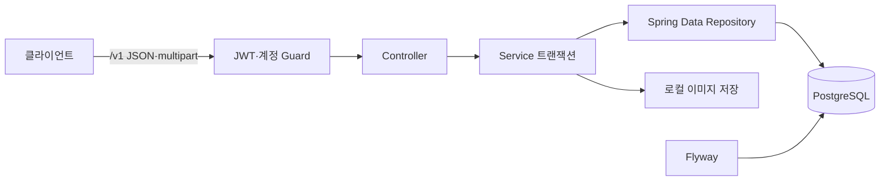

# 감정지도 백엔드 아키텍처

Java 21 · Spring Boot 4.1 · Gradle Wrapper 9.0 · PostgreSQL 17 · Spring Data JPA · Flyway

이 문서는 **현재 코드의 구조와 실행 방법**을 설명한다. 제품 요구는 [MVP_PLAN](docs/MVP_PLAN.md), 데이터 모델은 [ERD](docs/ERD.md), 전체 참여자 API 계약은 [API_SPEC](docs/API_SPEC.md)와 [OpenAPI](docs/openapi.yaml)를 참고한다. 최신 영속성 모델과 기존 호출부를 전환했지만 정기 배달·AI·전체 22개 API를 모두 구현한 것은 아니다.

## 1. 확정된 공통 스택

| 항목 | 현재 사용 |
| --- | --- |
| Java / Spring Boot | Java 21 toolchain / Spring Boot 4.1.0 |
| 빌드 | Gradle Wrapper 9.0.0, Kotlin DSL |
| DB | 로컬 PostgreSQL 17, Docker 미사용 |
| 영속성 | Spring Data JPA, Flyway, `ddl-auto: validate` |
| 인증 | Spring Security, jjwt 0.13.x, BCrypt |
| 문서 | springdoc-openapi 3.1.x |
| 테스트 | JUnit, ArchUnit, 별도 로컬 PostgreSQL 제약 검증 |
| 코드 | Lombok, 요청·응답 Java record |

현재 모델에는 벡터 컬럼이나 hibernate-vector 의존성이 없다. 다만 이미 배포된 마이그레이션 이력을 수정하지 않으므로 **V1 최초 실행에는 pgvector가 필요**하다. 확장을 임의로 제거하거나 V1의 체크섬을 바꾸지 않는다.

## 2. 저장소 구조 (백엔드 전용 레포)

프로젝트 루트가 Gradle 루트다. FE·AI는 별도 저장소이며, 이 저장소는 단일 Spring 애플리케이션·단일 DB를 사용한다.

| 모듈 | 소유 데이터·기능 |
| --- | --- |
| `account` | User, EmailPasswordCredential, UserPreferenceVersion, 로그인·온보딩·취향 |
| `memory` | Memory, MemoryCategory, 원문·사본·가시성·이미지 열람 |
| `place` | Place, PlaceCategory, 지도 핀·고정 분류 사전 |
| `letter` | DailySelection, LetterDelivery, 수신·읽음·좋아요 |
| `report` | Report, 신고 접수·처리 상태 |
| `media` | ImageUpload, durable image-request receipt, root binding, 임시 업로드·로컬 파일 저장·독립 복사·정리 |
| `platform` | JWT·접근 Guard 계약, JSON 파서, OpenAPI, 요청 소유권 lease |

### 2-1. 모듈 경계와 의존성 규칙

- 각 기능 안에 Entity·Repository·Service·Controller·DTO를 배치한다. 계층별 최상위 패키지나 별도 마이크로서비스를 추가하지 않는다.
- URL과 코드 소유권은 다르다. `/v1/places/{id}/memories`와 `/v1/memories/{id}/image`는 기억 접근 정책을 사용하는 `memory`가 소유한다.
- UUID FK를 스칼라 필드로 매핑하고 실제 관계 무결성은 Flyway의 FK가 보장한다. 소유권이 다른 Entity 사이의 양방향 JPA 연관관계·삭제 CASCADE를 추가하지 않는다.
- 좋아요는 동일 DB 트랜잭션에서 Memory·분류·수신 기록을 함께 갱신한다. 이번 전환에서 필요한 Entity·Repository·서비스 타입만 `ModuleArchitectureTest.PUBLIC_CONTRACTS`에 명시적으로 허용한다. 패키지 전체 허용은 하지 않는다.
- `MemoryReadAccess`는 기억 모듈이 소유하고 수신 모듈이 구현한다. 기억 모듈이 수신 서비스에 역으로 의존하지 않는다.
- `AccountAccessGuard`는 platform이 소유하고 account가 구현한다. JWT 필터가 account Entity·Repository를 직접 가져오지 않는다.
- 지도 Repository는 공유 DB에 대한 가시성 EXISTS 조건으로 조회한다. `place → memory → place` Java 순환을 만들지 않는다.
- ArchUnit은 명시된 모듈 소속, 공개 계약 외 접근, 모듈 간 순환 의존을 검사한다.

## 3. 시스템 구성도



이미지 파일은 파일시스템, 소유권·첨부 상태와 독립 경로는 DB에 둔다. DB 커밋과 파일 쓰기가 자동으로 원자적이라고 가정하지 않는다.

## 4. 데이터 모델

기본 도메인 10개와 이미지 수명 보완 테이블 `image_uploads`, root↔dataset 소유권 앵커 `image_storage_binding`이 있다.

- `app_users`: 초대 접근 상태·역할·온보딩 시 고정 위치.
- `email_password_credentials`: 계정 UUID PK/FK, 이메일·정규화 조회키·비밀번호 해시. 공급자 인증 모델은 사용하지 않는다.
- `user_preference_versions`: 불변 4축·설명·revision·effective_at. 새 write는 axis v2의 유한 binary64 `[-1,1]`; v1 행은 endpoint 값·버전·identity를 보존하고 같은 수치 PATCH는 새 revision을 만들지 않는다. 같은 사용자의 cutoff 이전 최신 버전을 조회한다.
- `places`, `place_categories`: 내부 핀과 고정 8종 분류.
- `memories`: 필수 연속 4축, 장소 스냅샷, 분류 출처·실행 상태, 공개 범위·기원·안전 상태·독립 이미지 경로. 사본은 원본 축 bits와 axis version을 보존한다.
- `memory_categories`: `(memory_id, category_id)` PK, 1~3 슬롯과 `(memory_id, slot_no)` UNIQUE.
- `daily_selections`: `(user_id, service_date)` PK, 사용자와 취향 버전의 복합 FK, cutoff·claim·lease·상태.
- `letter_deliveries`: `(receiver_id, service_date)`와 `(receiver_id, memory_id)`를 각각 UNIQUE로 유지. 최초 read_at·liked_at만 기록한다.
- `reports`: 사유 코드·details·처리 상태·담당자·처리 시각.
- `image_uploads`: 본인 소유 STAGED/ATTACHED 이미지와 EXPIRED 영수증. EXPIRED는 receipt·소유자·메타데이터·완료 요청 FK를 보존하되 `storage_path`는 NULL이다.

UUID ID, smallint 카테고리, `double precision` 4축, `Instant`/timestamptz, `LocalDate`/date, 문자열 enum을 사용한다. 축은 유한 `[-1,1]`이고 `-0`은 Java ingress에서 `+0`으로 정규화한다. FK는 RESTRICT이며 일반 삭제는 소프트 삭제다. `image_storage_binding`은 migration이 만든 dataset UUID를 UNBOUND로 두고, 명시적 초기화 뒤에만 root UUID·실제 DB/schema locator를 기록한다. Reaction·Bookmark·원문-사본 연결 테이블은 없다.

## 5. 프로필 전략

- `local` 기본: 실제 PostgreSQL 연결. `DB_URL`, `DB_USERNAME`, `DB_PASSWORD`로 변경한다.
- `ci`: DataSource/JPA/Flyway 자동구성 비활성화. DB 없는 테스트용이며 전체 앱 실행용이 아니다.
- `prod`: 서로 다른 32바이트 이상 `JWT_SECRET`·`SIGNING_SECRET`을 공급한다. 누락·짧은 값·동일값·알려진 개발용 값은 기동을 거부하며, `prod,local` 조합으로 우회할 수 없다. 개발용 DB 비밀번호도 재사용하지 않는다.
- 개발용 비밀과 mock AI 설정은 `local`·`ci` 전용이다. `prod`에는 non-mock `AI_PROVIDER`와 실제 분석·안전 검사·동률 평가 포트 구현이 모두 필요하다. 현재 저장소는 실제 provider를 구현하지 않았으므로 prod 기동 준비가 완료된 상태가 아니다.
- 비밀번호 해시 비용은 `PASSWORD_BCRYPT_STRENGTH`로 지정한다. BCrypt 라이브러리 허용 범위는 4–31이며 운영 비용은 배포 환경에서 별도로 실측·승인한다. `local`·`ci`의 4는 합성 테스트용 기본값이다. `prod`가 포함되면 혼합 프로필에서도 명시적 환경값이 없을 때 기동을 거부한다.

## 6. CI / CD (DB 비연결)

`.github/workflows/ci.yml`은 DB 없는 테스트를 수행한다. 릴리스 워크플로는 `v*` 태그에서 JAR을 빌드한다. 실제 PostgreSQL·파일·동시성 검증은 별도 로컬 테스트 DB에서 실행한다. 고객 데이터·DB 덤프를 CI나 저장소에 업로드하지 않는다.

## 7. 로컬 준비 (Docker 미사용)

```bash
brew install postgresql@17 pgvector
brew services start postgresql@17

# 로컬 개발 전용 계정 예시. 관리자 권한으로 실행한다.
psql -d postgres -c "CREATE USER emotionmap WITH PASSWORD 'emotionmap';"
psql -d postgres -c "CREATE DATABASE emotionmap OWNER emotionmap;"
psql -d emotionmap -c "CREATE EXTENSION IF NOT EXISTS vector;"

./gradlew bootRun
./gradlew test
./gradlew build
```

`psql`이 PATH에 없다면 PostgreSQL 17의 bin 경로를 사용한다. 기존 계정·DB에 생성 명령을 반복하지 않는다. Ubuntu/Debian에서는 해당 배포판의 PostgreSQL 17·pgvector 패키지를 준비한다.

로그인용 앱 계정은 DB 접속 계정과 별개다. 공개 회원가입 API와 계정 자동 seed는 없다. 최초 자격증명은 아래 내부 CLI로만 공급하며, 원문 비밀번호·공용 계정 시크릿을 SQL·Git·로그에 넣지 않는다.

### 7.1 최초 계정 공급

대상 DB·스키마에 현재 Flyway 마이그레이션을 먼저 적용한다. CLI는 `DB_URL`, `DB_USERNAME`, `DB_PASSWORD`, `DB_SCHEMA`, `PASSWORD_BCRYPT_STRENGTH`를 모두 명시적으로 요구하며 기본 개발 DB로 대체하지 않는다. CLI 자체는 migration·SQL init·웹 서버·JWT·AI 설정을 실행하거나 요구하지 않고 스키마를 `validate`만 한다.

```bash
./gradlew bootJar
java -Dloader.main=team4.emotionmap.account.AccountProvisioningCli \
  -cp build/libs/emotion-map-0.0.1-SNAPSHOT.jar \
  org.springframework.boot.loader.launch.PropertiesLauncher \
  --email participant@example.invalid --status PENDING
```

기본 모드는 실제 콘솔에서 숨김 입력을 받는다. 입력 안내 문구는 출력하지 않는다. 비밀번호를 입력하고 Enter를 누른다. 콘솔이 없으면 실패하며 비밀번호 argv·환경변수·평문 파일 입력으로 대체하지 않는다. 자동화는 승인된 비밀 공급 프로세스의 파이프로 `--password-stdin`을 사용한다. 표준입력은 UTF-8 원문 전체이며 끝의 개행도 비밀번호에 포함되므로 자동 추가하지 않는다. `provisionUser` Gradle task도 같은 CLI의 stdin 모드를 지원하며 devtools를 제외한 운영용 클래스패스를 사용한다. stdin 모드에서 터미널에 비밀번호를 직접 타이핑하지 않는다.

`--status`는 `ACTIVE` 또는 `PENDING`을 명시해야 한다. 역할은 항상 `USER`이고 위치·취향·온보딩 이력은 만들지 않는다. 성공한 CLI는 UUID와 상태만 출력한다. 실패는 고정 오류 문구와 종료 코드 1이며, 기존 이메일을 다시 공급해도 비밀번호·상태·로그인 제한을 재설정하지 않는다. 정규화 이메일의 제한 행을 로그인과 공유해 잠그고 계정·자격증명을 한 트랜잭션으로 만든다. 실제 참여자에 대한 승인과 개인별 비밀 전달은 별도 운영 절차다.

## 8. 팀 합의 규칙

- 로컬 PostgreSQL 사용, Docker 미사용.
- 실제 데이터·DB 덤프·고객 개인정보·시크릿 커밋 금지. Flyway DDL과 합성 테스트 fixture는 코드로 관리한다.
- 이미 확정된 제품/API 계약은 재설계하지 않는다. 미정 운영 한도는 설정으로 관리하며 개발 기본값을 운영 확정값으로 취급하지 않는다.
- 각 모듈의 주 담당자는 [공통 계약서](docs/plan/SHARED_CONTRACTS.md)를 따르고 공유 타입 변경은 소비자와 함께 검토한다.

## 9. Flyway 마이그레이션 작성 양식

위치는 `src/main/resources/db/migration/`, 이름은 `V{정수}__{snake_case 설명}.sql`이다.

| 파일 | 역할 |
| --- | --- |
| `V1__init.sql` | 과거 BIGSERIAL·vector 스키마. 이미 적용된 이력이므로 수정하지 않음 |
| `V2__erd_uuid_schema.sql` | 구형 테이블을 잠근 뒤 비어 있는지 확인하고 최신 UUID 스키마로 전환 |
| `V3__seed_place_categories.sql` | 자체 카테고리 8종 seed |
| `V10__continuous_atmosphere_axes.sql` | 8개 취향·경험 축을 `double precision`으로 전환하고 v2 기본값·v1 endpoint 역사 제약을 추가 |

**V2는 구형 데이터가 한 건이라도 있으면 실패한다.** 데이터를 삭제하거나 필수 4축·취향·수신 이력을 임의로 채우지 않는다. 별도 빈 개발 DB를 사용하거나 승인된 데이터 이관 설계를 먼저 마련한다. V2의 실패는 전체 트랜잭션을 롤백하므로 구형 테이블을 일부만 제거하지 않는다.

새 마이그레이션 작성 전 최신 번호를 확인한다. BE1이 번호·적용 순서를 취합하고 각 담당자가 자기 변경을 작성한다. 이미 적용된 파일은 이름·내용을 바꾸지 않고 새 마이그레이션으로 수정한다. DB 초기화·Flyway clean을 자동 해결책으로 실행하지 않는다.

전체 마이그레이션 후 전용 테스트 DB에서 실행:

```bash
psql "$TEST_DATABASE_URL" -v ON_ERROR_STOP=1 -f src/test/resources/db/erd_constraints.sql
```

SQL 검증은 합성 fixture를 롤백하며 축·카테고리 상한·복합 FK·중복 배달·날짜·RESTRICT를 검사한다. 실제 API의 권한·동시성·파일 복구 검증을 대신하지 않는다.

## 10. 브랜치 전략

경량 GitHub Flow: 작업별 `feat/*`, `fix/*`, `docs/*`, `refactor/*`, `chore/*` 브랜치와 PR을 사용한다. `main` 직접 push 금지, CI 통과와 상대 리뷰 후 병합한다. 사람별 장기 브랜치를 만들지 않는다. PR에는 실행한 검증과 실행하지 않은 검증을 구분한다.

## 11. 코딩 컨벤션 (Lombok · JPA 엔티티)

- Entity: `@Getter`, protected 기본 생성자, `@Builder`; `@Setter`/`@Data` 사용 금지. 상태 변경은 의미 있는 메서드로 제한한다.
- Service: 생성자 주입, 사용사례 단위 `@Transactional`. 같은 사용사례의 하위 저장 기능을 별도 커밋하지 않는다.
- DTO: Java record. Entity 전체를 그대로 직렬화하지 않는다.
- 스키마는 Flyway만 생성하며 Hibernate는 검증한다. 텍스트는 `text`, enum은 문자열로 매핑한다.
- 불변 취향 버전은 `@Immutable`, 읽기·저장 Repository로 제공한다. 버전 번호만 남기고 실제 값을 덮어쓰지 않는다.
- 글로벌 JSON 설정은 중복 키·알 수 없는 필드·스칼라 강제 변환을 거절한다. 4축은 토큰 수준에서 변환 전 범위를 확인한 유한 binary64 `[-1,1]`이며 `-0`은 `+0`으로 정규화한다. slider step이나 표시 자릿수로 값을 양자화하지 않는다.
- 현재 직접 경험 생성은 수동 분류만 지원한다. `USER`/`NOT_RUN`을 기록하고 안전 상태는 `PENDING`으로 남긴다. AI가 없는 상태를 승인·분석 성공으로 처리하지 않는다.

## 12. 이미지 처리 (로컬 저장 · JSON/바이너리 API 분리)

1. `POST /v1/images`는 JPG/PNG multipart의 보호 경로다. 인증과 transport gate를 지난 뒤 query가 없고 file part가 정확히 하나이며 UUID `Idempotency-Key`가 정확히 하나인 요청만 받는다. 원본 바이트의 SHA-256 지문과 소유자·경로·키를 영속 요청 행으로 조정한다. 첫 완료는 `201`, 같은 완료 요청의 영수증 재생은 `200`이며 응답 본문을 저장하지 않는다.
2. 새 요청은 현재 ACTIVE 소유자를 확인하고 실제 입력을 최대 `B + 1`바이트까지 읽어 JPEG/PNG·바이트·폭·높이·픽셀을 검사·재인코딩한다. 새 UUID 키 파일과 STAGED 메타데이터를 같은 완료 경계에서 만든다. 재생은 파일을 다시 열거나 현재 이미지 제한/TTL을 다시 적용하지 않는다: 미만료 STAGED와 ATTACHED는 영수증을 반환하고, 만료 STAGED/EXPIRED는 `410 IMAGE_UPLOAD_EXPIRED`다.
3. `POST /v1/memories`는 본인·미만료·미사용 imageId를 잠그고 경험 저장과 첨부를 같은 트랜잭션으로 확정한다. `GET /v1/memories/{id}/image`는 경험 소유/수신 권한과 상태를 확인한 뒤 caller-closed 바이너리 stream을 연다. raw key 공개 GET은 없고, binding/marker/실제 locator 검증을 통과하지 못한 root는 read도 `503 IMAGE_FILE_UNAVAILABLE`로 닫는다.
4. 만료 worker는 STAGED 행을 잠그고 만료·미첨부·무참조를 확인한 뒤 `EXPIRED`와 nullable `storage_path=NULL` 영수증을 먼저 커밋한다. 물리 파일은 이후 새 READ COMMITTED collector가 root binding, DB advisory fence, OS writer/collector fence 및 `image_uploads`·ACTIVE/HIDDEN/DELETED memory의 모든 참조 부재를 다시 확인할 때만 지운다. age는 삭제 근거가 아니다.

설정: `APP_STORAGE_MULTIPART_REQUEST_OVERHEAD_BYTES`는 양수 multipart 오버헤드이고, 이미지 업무 한도·STAGED TTL은 `app.service.limits`가 유일한 원천이다. `REQUEST_COORDINATION_LEASE_DURATION`은 양수 ISO-8601 `Duration`, `IMAGE_CLEANUP_INTERVAL`은 양수 ISO-8601 `Duration`, `IMAGE_CLEANUP_BATCH_SIZE`는 양의 정수다. 세 값에는 운영 기본값이 없다. lease가 없거나 무효면 새 request claim/recovery가 닫히며, interval 또는 batch가 없거나 무효면 새 이미지 파일 쓰기와 정리가 `CONFIGURATION_UNAVAILABLE`로 닫힌다. 기존 binding된 파일 read와 완료 영수증은 해당 설정을 다시 읽어 부정하지 않는다.

정리는 batch만큼의 UUID 키를 한 번에 순회한다. directory iterator는 batch 사이에 유지하고 끝에서만 다시 시작하므로, batch size 2의 순환 사례에서는 처음 항목만 반복해 뒤 항목이 굶는 문제를 피한다. 이는 그 batch 회전 사례의 근거일 뿐 모든 고아 파일이 결국 수거된다는 운영 진행성 증명은 아니다.

일반 startup은 UNBOUND DB에서 root·marker를 생성하거나 legacy 파일을 adopt하지 않는다. 새 빈 dataset과 새 전용 빈 root의 연결만 `storage-init-empty` subcommand가 수행한다:

```bash
java -jar build/libs/emotion-map-0.0.1-SNAPSHOT.jar storage-init-empty \
  --root /approved/new-empty-image-root \
  --expected-dataset-id <v9-dataset-uuid> \
  --expected-database <database-name> \
  --expected-schema <schema-name>
```

CLI는 `DB_URL`, `DB_USERNAME`, `DB_PASSWORD`, `DB_SCHEMA`를 명시적으로 요구하고 실제 DB/schema/locator, UNBOUND binding, image upload·memory image 참조 부재, 새 root의 비어 있음을 확인한다. marker는 CREATE_NEW로 기록하며 성공은 `0`, 잘못된 인자·안전 전제 거절은 `2`, DB·파일 의존성 실패는 `1`이다. 기존 root, legacy data, clone/restore를 비우거나 adopt·reset·삭제하지 않는다. clone의 copied dataset UUID만으로는 충분하지 않고 locator 불일치도 거절한다. DB·marker·locator가 bit-for-bit으로 같은 in-place physical restore는 코드가 일반 재시작과 구분할 수 없으므로, 백업 연결성·writer/collector 중지·재결합은 별도 승인 운영 절차다.

저장·독립 복사 중 부분 파일과 확실한 rollback의 파일만 회수 후보가 된다. commit 결과 미상은 보존한다. 원문/사본은 독립 파일이고 source-copy 링크·storage key 로그·GC queue를 추가하지 않는다.

## 13. API 명세 (springdoc-openapi / Swagger UI)

- 업무 경로: `https://{domain 또는 IP}/v1/{endpoint}`. 무버전 및 `/api/...` 호환 경로는 없다.
- `API_BASE_URL`은 origin이고, `docs/openapi.yaml`의 paths에 `/v1`이 포함된다. 중복 접두어를 붙이지 않는다.
- `/swagger-ui.html`, `/v3/api-docs`는 현재 Controller/DTO에서 생성한 실제 제공 API 문서다. Actuator와 함께 업무 API 버전 경로 밖의 기술 경로다.
- `docs/API_SPEC.md`, `docs/openapi.yaml`은 전체 제품 계약이다. 현재 코드의 모든 응답·페이지·오류가 이 계약을 완성했다는 뜻은 아니다. 현재 범위와 미구현 항목은 [README](README.md#현재-구현-범위)를 참고한다.

## 14. 인증/인가 (Spring Security + JWT)

- 공개 업무 API는 `POST /v1/auth/login`뿐이다. Swagger와 health는 별도 공개 기술 경로다.
- Principal과 JWT subject는 UUID다. 클라이언트가 보내는 ownerId/userId를 신뢰하지 않는다.
- BCrypt 자격증명을 검사한 뒤 ACTIVE 상태를 확인한다. 없는 이메일·틀린 비밀번호는 같은 인증 실패를 반환한다.
- 이메일은 올바르게 형성된 Unicode만 허용하고, 기존 `strip`·`Locale.ROOT` 소문자화를 최초 공급과 로그인에 동일하게 적용한다. 잘못된 surrogate를 대체 바이트로 바꿔 다른 식별자·제한 키로 처리하지 않는다. 비밀번호는 변형하지 않으며 비어 있지 않은 유효 UTF-8 최대 72바이트만 받는다. 기존 BCrypt 해시의 내장 비용으로 검증하고 자동 재해시는 하지 않는다.
- 로그인 제한은 PostgreSQL `login_attempt_limits`에 저장한다. 키는 정규화 이메일에 도메인 접두어를 붙인 SHA-256 소문자 64자리 hex다. 원문 이메일을 저장하지 않는 가명화이지 사전 공격에 대한 익명화·비밀 보호는 아니다.
- 실패 한도 N과 잠금 초 L은 공개 서비스 설정, 고정 관찰 구간 W는 양수 `LOGIN_FAILED_ATTEMPT_WINDOW_SECONDS`다. W에는 운영 기본값이 없다. 첫 실패부터 W를 계산하고 N번째 실패부터 429로 잠근다. 잠금 중 올바른 비밀번호도 429이며 창·기한을 연장하지 않는다. 응답과 `Retry-After`는 실제 남은 초를 올림한 같은 양수다.
- 키 행 → 현재 사용자 → 자격증명 순서로 잠그고 검증 후 DB 시각으로 창·잠금을 결정한다. 올바른 비밀번호는 이후 계정 상태가 403이더라도 제한을 먼저 커밋해 초기화한다. 없는 이메일도 같은 제한과 프로세스별 dummy BCrypt 검증을 사용한다. 입력 오류·DB/검증기 장애는 비밀번호 실패로 집계하지 않는다. 필수 인증 설정·W가 없거나 유효하지 않으면 로그인은 503이며 제한 행을 변경하지 않는다.
- 보호 요청에서도 현재 계정 상태를 확인하고 온보딩 전 허용 경로를 제한한다. JWT 발급 당시 ACTIVE였다는 사실만 믿지 않는다.
- `JWT_SECRET`·`SIGNING_SECRET`은 환경변수로 주입한다. 토큰의 초 단위 TTL과 로그인 응답은 `SERVICE_AUTH_ACCESS_TOKEN_TTL_SECONDS`를 함께 사용한다. 기존 `JWT_EXPIRATION_MILLIS`는 사용하지 않는다. 필요한 서비스 설정이 없으면 발급은 503으로 실패한다. 발급·검증은 동일한 UTC `Clock`을 사용한다.
- 현재 access token만 발급하고 refresh·공개 가입·위치 변경 경로는 제공하지 않는다.
- `CORS_ALLOWED_ORIGINS`는 쉼표로 구분한 정확한 origin allowlist다. wildcard·credential cookie는 허용하지 않는다. 허용된 preflight만 CORS 필터가 처리하며 일반 OPTIONS 요청의 업무 API 인증은 유지한다. 브라우저에 `X-Request-Id`·`Retry-After`·`WWW-Authenticate`를 노출한다.
- 본인 또는 실제 수신자라는 객체별 접근 자격을 확인한다. 삭제·숨김 대상은 기존 접근자에게 410, 미권한자에게 404를 반환한다. 이미지·핀·집계에도 같은 가시성 원칙을 적용한다.
- 내부 ERROR dispatch는 원래 오류 상태를 보존하도록 허용한다. 이는 외부 `/error` 요청을 공개한다는 뜻이 아니다.
- Swagger의 Authorize에 발급된 JWT를 넣어 보호 API를 호출한다. 공개 운영자 도구·전체 공통 오류 계약은 별도 구현 항목이며 내부 계정 공급 CLI가 운영자 API를 의미하지 않는다.
