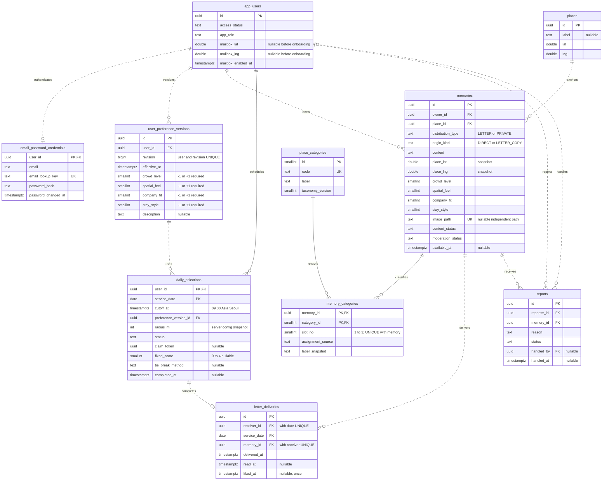

# 감정지도 — ERD 및 데이터베이스 설계서

- 설계 버전: **ERD 1.0**
- 기준 기획서: `emotion_map_mvp_v1_4_final.md` (`1.4-final`, 2026-09-19)
- 목적: 기획서 11장의 논리 모델을 FE·BE·AI 공통 계약에 사용할 관계·키·컬럼·제약·트랜잭션으로 구체화
- 범위: PostgreSQL 기반, 5인·19시간 핵심 MVP. PUBLIC·댓글은 후순위이며 현재 DDL에는 구현하지 않음
- 상태: **제품 정책 유지 / 이 문서의 물리 모델과 내부 명칭은 구현 제안**
- 검증 범위: 원문 대조, 문서·DDL·관계의 정적 점검, 점수·카테고리 슬롯 규칙의 산술 점검. 실제 PostgreSQL 실행·동시성·파일·API 테스트는 수행하지 않음

> 이 설계는 운영 DB를 변경하지 않는다. 첨부 SQL은 새 빈 스키마에 적용하기 위한 PostgreSQL 16+ 문법의 Flyway 초안이다. 실제 버전·마이그레이션 번호·인증 방식은 개발 환경에서 확인한다. 원래 MVP 기획서는 수정하지 않았다.

## 목차

1. [핵심 설계 결정](#1-핵심-설계-결정)
2. [ERD와 관계](#2-erd와-관계)
3. [공통 타입과 사전](#3-공통-타입과-사전)
4. [테이블 상세](#4-테이블-상세)
5. [무결성 제약](#5-무결성-제약)
6. [시간·버전·상태](#6-시간버전상태)
7. [조회와 인덱스](#7-조회와-인덱스)
8. [주요 트랜잭션](#8-주요-트랜잭션)
9. [삭제·권한·외부 처리](#9-삭제권한외부-처리)
10. [DDL 적용·검증](#10-ddl-적용검증)
11. [인계 시 남길 계약](#11-인계-시-남길-계약)
12. [근거 자료](#12-근거-자료)

---

## 1. 핵심 설계 결정

### 1.1 기본 테이블은 10개

| 영역 | 테이블 | 핵심 책임 |
|---|---|---|
| 계정 | `app_users` | 초대 접근 상태·운영 역할·변경 불가한 수신 위치 |
| 인증 | `email_password_credentials` | 이메일·비밀번호 자격증명, 계정당 1개 |
| 취향 | `user_preference_versions` | 4축·선택 자연어의 불변 버전 이력 |
| 위치 | `places` | 내부 핀 식별자·좌표 |
| 경험 | `memories` | LETTER와 PRIVATE 원문·복사본의 공통 저장 |
| 분류 | `place_categories` | 사용자 확정 자체 카테고리 8종 |
| 경험-분류 | `memory_categories` | 경험마다 0~3개의 복수 분류 |
| 일일 작업 | `daily_selections` | 사용자·KST 날짜별 선정 슬롯·실패·빈 결과 |
| 수신 | `letter_deliveries` | 실제 받은 LETTER·읽음·한 번의 좋아요 |
| 운영 | `reports` | 신고·검토·처리 담당자와 결과 |

### 1.2 기획서의 논리 모델을 그대로 테이블 하나씩으로 옮기지 않은 이유

**고정 4축은 컬럼으로 둔다.** `UserAtmosphere`, `MemoryAtmosphere`의 축별 행 대신 `crowd_level`, `spatial_feel`, `company_fit`, `stay_style` 네 컬럼을 사용한다. 현재는 축이 정확히 네 개이고 모두 필수이며 값도 -1/+1이므로 행 누락·5번째 축·중복 축을 걱정하는 관계형 EAV보다 행 단위 NOT NULL·CHECK로 검사하기 쉽다. 축을 운영 중 추가하는 기능은 없다. 확장 시에는 마이그레이션한다. 네 개의 축 설명은 코드/설정 상수로 제공하며 별도의 동적 `atmosphere_axes` 테이블은 만들지 않는다.

**현재 취향만 덮어쓰지 않는다.** 오전 9시 기준 설정을 오후의 장애 복구에서도 읽어야 하므로 실제 값을 가진 `user_preference_versions`를 추가한다. `revision=3` 숫자만 남기고 3번의 값을 덮어쓰면 시점 재현이 불가능하다. 기획서 6.5.2의 불변 이력 요구를 구체화한 것이다.

**일일 작업과 실제 수신을 분리한다.** 후보가 없는 날짜도 한 번 검사한 결과를 남겨야 하므로 `daily_selections`는 필요하다. 실제로 한 편이 배달될 때만 `letter_deliveries`가 생긴다. 수신함 새로고침은 두 테이블의 저장된 결과만 읽는다.

**BOOKMARK·Reaction·원문-사본 연결 테이블을 만들지 않는다.** BOOKMARK는 소유 PRIVATE의 조회이고 반응은 `letter_deliveries.liked_at`이다. 사본에 `source_memory_id`·원작성자·원배달 ID를 넣지 않고 원문에도 사본 역참조를 추가하지 않는다.

**장소와 경험의 위치 스냅샷을 분리한다.** `places`는 내부 핀을 묶는 식별자이며, 경험에 복사된 좌표·표시명은 그 기록을 읽고 거리를 판정하는 기준이다. 공유 Place ID는 원문 연결이 아니지만 Place 변경이 과거 사본의 표시를 바꾸게 하지는 않는다.

**여러 편지함·인증 공급자 확장·PUBLIC·임베딩용 테이블은 선제 구현하지 않는다.** 로그인은 이메일·비밀번호 전용이다. API_SPEC의 최신 인증 보완안을 반영해 공급자 식별자 모델 대신 `email_password_credentials`를 사용한다. 임시 이미지 소유권·첨부 상태는 별도 `image_uploads` 보완 테이블로 관리하며 기본 도메인 10개와 구분한다.

## 2. ERD와 관계

그림은 핵심 컬럼을 표시한다. 전체 타입·NULL·제약은 4장 및 `sql/V1__emotion_map_schema.sql`이 기준이다. Mermaid 소스는 `diagrams/emotion_map_erd.mmd`에 있다.



### 2.1 관계 해설

| 부모 → 자식 | 카디널리티 | FK·의미 |
|---|---|---|
| app_users → email_password_credentials | 1 : 0..1 | 이메일·비밀번호 자격증명 1개. 공급자 로그인·자동 회원가입 없음 |
| app_users → user_preference_versions | 1 : 0..N | 온보딩 전 0, 완료 이후 1개 이상. 매 수정마다 새 버전 |
| app_users → memories | 1 : 0..N | 소유자. LETTER_COPY의 owner는 보관한 수신자 |
| places → memories | 1 : 0..N | 모든 경험은 선택한 내부 핀을 참조 |
| memories → memory_categories | 1 : 0..3 | `slot_no` 제약으로 상한 3 보장 |
| place_categories → memory_categories | 1 : 0..N | 사전에 정의한 유형만 연결 |
| app_users → daily_selections | 1 : 0..N | 한 날짜에는 최대 한 작업 |
| user_preference_versions → daily_selections | 1 : 0..N | 그날 사용할 불변 취향 버전. 복합 FK로 소유자 일치 검사 |
| daily_selections → letter_deliveries | 1 : 0..1 | 실제 수신 성공일 때만 1개 |
| memories → letter_deliveries | 1 : 0..N | 한 LETTER는 여러 사용자에게 갈 수 있음. 원문 전역 단일 소비가 아님 |
| app_users → reports | 1 : 0..N | 신고자와 처리 담당자의 서로 다른 두 관계. 담당자는 미배정 가능 |
| memories → reports | 1 : 0..N | 신고 대상 경험. 원문-사본 묶음을 의미하지 않음 |

도식의 `0..N`은 빈 테이블·온보딩 중 상태도 표현한 DB 관계다. 예를 들어 완료 계정의 취향 버전이 최소 1개여야 한다는 동작은 온보딩 트랜잭션이 보장한다.

## 3. 공통 타입과 사전

### 3.1 타입·명명 규칙

| 대상 | 제안 |
|---|---|
| 테이블·컬럼 | `snake_case`, 테이블은 복수형 |
| 경험·계정 등 식별자 | `uuid`, PostgreSQL 기본 UUID 생성 함수 또는 애플리케이션 발급 |
| 고정 분류 ID | `smallint` |
| 4축 | `smallint NOT NULL CHECK (value IN (-1,1))` |
| 순간 시각 | `timestamptz` |
| 서비스 날짜 | `date`, 반드시 Asia/Seoul에서 계산 |
| 좌표 | `double precision`, 위도 -90~90·경도 -180~180 범위 검사 |
| 본문·설명·경로 | `text`; 최대 길이는 미정이므로 임의 VARCHAR 한도 설정 없음 |
| 상태 | `text + CHECK`; Java는 문자열 enum 매핑 제안. ordinal 저장 없음 |
| 삭제 | 공개 접근은 즉시 차단하는 소프트 삭제. 수신·일일 이력은 같이 지우지 않음 |

PostgreSQL의 CHECK는 NULL을 거절하는 기능이 아니므로 필수값에는 NOT NULL을 함께 둔다. `timestamptz`는 순간을 다루며 화면 출력의 시간대와 서비스 날짜는 별도로 지정한다. [P1][P2]

### 3.2 확정 분위기 4축

| 순서·컬럼 | -1 | +1 |
|---|---|---|
| 1. `crowd_level` | 조용한 | 북적이는 |
| 2. `spatial_feel` | 아늑한 | 탁 트인 |
| 3. `company_fit` | 혼자 가기 좋은 | 함께 가기 좋은 |
| 4. `stay_style` | 오래 머물기 좋은 | 잠깐 들르기 좋은 |

-1/+1은 평가의 좋고 나쁨이 아니다. `0`, NULL, 세 번째 값은 최종 저장에 허용하지 않는다. AI 분석 응답은 미결을 표현할 수 있지만 작성자가 최종 네 값을 보완한다.

### 3.3 확정 자체 카테고리

| 제안 ID | 제안 코드 | 확정 표시명 |
|---:|---|---|
| 1 | CAFE | 카페 |
| 2 | RESTAURANT | 음식점 |
| 3 | BAR | 술집 |
| 4 | PARK_WALK | 공원·산책 |
| 5 | CULTURE | 문화 |
| 6 | STUDY_WORK | 공부·작업 공간 |
| 7 | SHOPPING | 쇼핑 |
| 8 | OTHER | 기타 |

명칭·최대 세 유형은 제품 정책이다. 숫자 ID·코드·포함 사례는 구현 제안이다. `기타`는 분류값, 미분류는 연결 행이 0개인 상태다. AI 실패를 자동으로 OTHER에 넣지 않는다. 분류는 경험의 본문을 분석한 값이며 네이버의 공식 업종 코드가 아니다.

## 4. 테이블 상세

각 표는 컬럼 사전이며 NULL은 **허용 여부**다. `기본`이 명시되지 않은 필수값은 애플리케이션이 전달한다. 추가 CHECK·FK 명칭의 전체 정의는 DDL에 있다.

### 4.1 `app_users`

온보딩 전에는 위치 3개 필드가 모두 NULL이고 완료 후에는 모두 존재한다. 완료 계정의 최초 취향 버전 생성은 같은 트랜잭션으로 처리한다.

| 컬럼 | 타입 | NULL | 키·기본값 | 의미 |
|---|---|---|---|---|
| `id` | `uuid` | 불가 | PK, 기본 gen_random_uuid() | 행 식별자 |
| `nickname` | `text` | 가능 | — | 내부 계정 표시명. 수신자용 익명 API에는 포함하지 않음 |
| `access_status` | `text` | 불가 | 기본 'PENDING' | 초대·접근 상태. 인증 성공과 별개 |
| `app_role` | `text` | 불가 | 기본 'USER' | 일반 사용자/운영자 |
| `mailbox_lat` | `double precision` | 가능 | — | 최초 설정한 수신 기준 위도 |
| `mailbox_lng` | `double precision` | 가능 | — | 최초 설정한 수신 기준 경도 |
| `mailbox_enabled_at` | `timestamptz` | 가능 | — | 유효한 온보딩 완료 및 수신 시작 시각 |
| `created_at` | `timestamptz` | 불가 | 기본 clock_timestamp() | 행 생성 시각 |
| `updated_at` | `timestamptz` | 불가 | 기본 clock_timestamp() | 서버가 쓰기 때 갱신. DEFAULT만으로 UPDATE 시 자동 변경되지는 않음 |


### 4.2 `email_password_credentials`

최신 이메일·비밀번호 인증 계약에 따라 이전 `auth_identities` 제안을 대체한다. `user_id`가 PK·FK이고 이메일 조회키는 UNIQUE다. 원문 비밀번호·복호화 가능한 비밀번호·토큰 원문을 저장하지 않는다.

| 컬럼 | 타입 | NULL | 키·기본값 | 의미 |
|---|---|---|---|---|
| `user_id` | `uuid` | 불가 | PK, FK → app_users | 대상 계정 |
| `email` | `text` | 불가 | — | 로그인·응답 이메일 |
| `email_lookup_key` | `text` | 불가 | UNIQUE | 계정 준비·로그인에 동일 규칙을 적용한 조회키 |
| `password_hash` | `text` | 불가 | — | PasswordEncoder로 검증하는 비밀번호 해시 |
| `password_changed_at` | `timestamptz` | 불가 | 기본 clock_timestamp() | 마지막 자격증명 변경 시각 |
| `created_at` | `timestamptz` | 불가 | 기본 clock_timestamp() | 생성 시각 |
| `updated_at` | `timestamptz` | 불가 | 기본 clock_timestamp() | 마지막 갱신 시각 |


### 4.3 `user_preference_versions`

현재값은 최신 유효 버전 조회로 얻는다. 버전별 전체 네 축과 자연어를 저장하며, 수정하지 않는다는 계약을 지킨다. daily FK가 타인의 버전을 참조하지 못하게 (id,user_id)도 UNIQUE다.

| 컬럼 | 타입 | NULL | 키·기본값 | 의미 |
|---|---|---|---|---|
| `id` | `uuid` | 불가 | PK, 기본 gen_random_uuid() | 행 식별자 |
| `user_id` | `uuid` | 불가 | FK | 대상/소유 계정 |
| `revision` | `bigint` | 불가 | — | 사용자별 증가하는 버전. 기존 버전 UPDATE 대신 INSERT |
| `effective_at` | `timestamptz` | 불가 | 기본 clock_timestamp() | 서버가 정하는 버전 적용 시각 |
| `crowd_level` | `smallint` | 불가 | -1/+1 | 조용한 -1 / 북적이는 +1 |
| `spatial_feel` | `smallint` | 불가 | -1/+1 | 아늑한 -1 / 탁 트인 +1 |
| `company_fit` | `smallint` | 불가 | -1/+1 | 혼자 가기 좋은 -1 / 함께 가기 좋은 +1 |
| `stay_style` | `smallint` | 불가 | -1/+1 | 오래 머물기 좋은 -1 / 잠깐 들르기 좋은 +1 |
| `description` | `text` | 가능 | — | 선택 자연어 취향. 공백은 NULL로 정규화 |
| `axis_definition_version` | `smallint` | 불가 | 기본 1 | 4축 의미의 버전. 현재 1 |


### 4.4 `places`

사용자가 핀을 지정해 만든 내부 지점이다. 같은 좌표의 다른 건물층·이용 목적을 강제로 합치지 않는다. 가시 경험이 없는 Place를 전 사용자에게 열람시키지 않는다.

| 컬럼 | 타입 | NULL | 키·기본값 | 의미 |
|---|---|---|---|---|
| `id` | `uuid` | 불가 | PK, 기본 gen_random_uuid() | 행 식별자 |
| `label` | `text` | 가능 | — | 표시명 |
| `lat` | `double precision` | 불가 | — | 위도. SDK에서 선택한 좌표 |
| `lng` | `double precision` | 불가 | — | 경도. SDK에서 선택한 좌표 |
| `created_at` | `timestamptz` | 불가 | 기본 clock_timestamp() | 행 생성 시각 |


### 4.5 `place_categories`

8종 고정 seed를 제공한다. 스키마 권한이나 Flyway 외의 일반 수정은 허용하지 않는 방향이다.

| 컬럼 | 타입 | NULL | 키·기본값 | 의미 |
|---|---|---|---|---|
| `id` | `smallint` | 불가 | PK | 행 식별자 |
| `code` | `text` | 불가 | UNIQUE | 내부 고정 분류 코드 |
| `label` | `text` | 불가 | — | 표시명 |
| `definition` | `text` | 불가 | — | 분류 가이드. 팀 검토 대상 |
| `sort_order` | `smallint` | 불가 | UNIQUE | 표시 순서 |
| `taxonomy_version` | `smallint` | 불가 | 기본 1 | 카테고리 의미의 버전. 현재 1 |


### 4.6 `memories`

최종 저장된 기록만 보관한다. AI 분석 중 미결 값은 응답 DTO에서 표현하고 DB 최종값은 네 축 모두 필수다. 원문·사본의 self-FK는 없다.

| 컬럼 | 타입 | NULL | 키·기본값 | 의미 |
|---|---|---|---|---|
| `id` | `uuid` | 불가 | PK, 기본 gen_random_uuid() | 행 식별자 |
| `owner_id` | `uuid` | 불가 | FK | 경험 소유자. 사본에서는 보관한 수신자 |
| `place_id` | `uuid` | 불가 | FK | 내부 핀 식별자. NAVER 업체 인증 아님 |
| `distribution_type` | `text` | 불가 | — | 현재 DDL은 LETTER / PRIVATE만 허용. PUBLIC은 후속 migration |
| `origin_kind` | `text` | 불가 | — | DIRECT / LETTER_COPY. 복사 여부일 뿐 원본 연결이 아님 |
| `data_origin` | `text` | 불가 | — | PARTICIPANT / TEAM_TEST / SYNTHETIC. 사본에도 복사하여 실제 작성 통계와 분리 |
| `content` | `text` | 불가 | — | 필수 자연어 본문. 공백만 불가 |
| `place_label_snapshot` | `text` | 가능 | — | 경험 생성/복사 당시 장소 표시명 |
| `place_lat` | `double precision` | 불가 | — | 경험의 위도 스냅샷. 거리·지도 표시의 기준 |
| `place_lng` | `double precision` | 불가 | — | 경험의 경도 스냅샷 |
| `crowd_level` | `smallint` | 불가 | -1/+1 | 조용한 -1 / 북적이는 +1 |
| `spatial_feel` | `smallint` | 불가 | -1/+1 | 아늑한 -1 / 탁 트인 +1 |
| `company_fit` | `smallint` | 불가 | -1/+1 | 혼자 가기 좋은 -1 / 함께 가기 좋은 +1 |
| `stay_style` | `smallint` | 불가 | -1/+1 | 오래 머물기 좋은 -1 / 잠깐 들르기 좋은 +1 |
| `crowd_source` | `text` | 불가 | — | 이 축의 최종값 출처 AI / USER. 복사 시 원래 분류 출처 유지 |
| `spatial_source` | `text` | 불가 | — | 이 축의 최종값 출처 AI / USER |
| `company_source` | `text` | 불가 | — | 이 축의 최종값 출처 AI / USER |
| `stay_source` | `text` | 불가 | — | 이 축의 최종값 출처 AI / USER |
| `axis_definition_version` | `smallint` | 불가 | 기본 1 | 4축 의미의 버전. 현재 1 |
| `atmosphere_analysis_status` | `text` | 불가 | — | AI 분석 성공/일부/실패/미호출. 최종 4축 완성과 별개 |
| `category_analysis_status` | `text` | 불가 | — | AI 분류 실행 결과. 최종 카테고리 행 개수와 별개 |
| `analysis_model` | `text` | 가능 | — | 사용한 분류 모델. 수동·미호출이면 없을 수 있음 |
| `analysis_prompt_version` | `text` | 가능 | — | 분류 프롬프트 버전. 원문·사본 추적 키를 저장하지 않음 |
| `image_path` | `text` | 가능 | UNIQUE | 서버 생성 상대 경로. 사본은 독립 경로, 없는 사진은 NULL |
| `image_media_type` | `text` | 가능 | — | image/jpeg 또는 image/png |
| `image_size_bytes` | `bigint` | 가능 | — | 파일 바이트 수. 상한은 운영 계약 |
| `content_status` | `text` | 불가 | 기본 'ACTIVE' | ACTIVE / HIDDEN / DELETED. 안전 심사 상태와 분리 |
| `moderation_status` | `text` | 불가 | 기본 'PENDING' | 배달 전 검사 결과. PRIVATE는 별도 운영 정책 |
| `available_at` | `timestamptz` | 가능 | — | LETTER 최초 후보 준비 완료 시각. PRIVATE는 NULL |
| `created_at` | `timestamptz` | 불가 | 기본 clock_timestamp() | 행 생성 시각 |
| `deleted_at` | `timestamptz` | 가능 | — | 일반 삭제 확정 시각 |


### 4.7 `memory_categories`

메모리 1건에 0~3행. PK는 같은 분류의 중복을 막고 slot_no UNIQUE는 개수 상한을 막는다. 의미상 기타 중복 등은 분류 가이드에 따른다.

| 컬럼 | 타입 | NULL | 키·기본값 | 의미 |
|---|---|---|---|---|
| `memory_id` | `uuid` | 불가 | PK, FK | 대상 경험. memory_categories에서는 PK 일부 |
| `category_id` | `smallint` | 불가 | PK, FK | 자체 카테고리 FK, PK 일부 |
| `slot_no` | `smallint` | 불가 | — | 1~3 범위의 저장 슬롯. 관련도 순위 아님 |
| `assignment_source` | `text` | 불가 | — | 최종 분류 출처 AI / USER |
| `label_snapshot` | `text` | 불가 | — | 연결 생성/복사 당시 표시명 |
| `taxonomy_version` | `smallint` | 불가 | 기본 1 | 카테고리 의미의 버전. 현재 1 |


### 4.8 `daily_selections`

한 사용자·날짜에 한 작업. 실제 배달이 없어도 NO_CANDIDATE를 남긴다. completed_at은 종결 상태에만 존재한다. FK·CHECK만으로 DELIVERED와 수신 행의 양방향 존재 일치까지 보장하지는 않는다.

| 컬럼 | 타입 | NULL | 키·기본값 | 의미 |
|---|---|---|---|---|
| `user_id` | `uuid` | 불가 | PK, FK | 대상/소유 계정 |
| `service_date` | `date` | 불가 | PK | Asia/Seoul 기준 날짜. 슬롯 PK/수신 유일성 구성 |
| `cutoff_at` | `timestamptz` | 불가 | — | 서비스 날짜의 예정 09:00. 지연 실행 시에도 고정 |
| `preference_version_id` | `uuid` | 불가 | FK | 그날 사용할 실제 불변 취향 버전. user_id와 복합 FK |
| `radius_m` | `integer` | 불가 | — | 서비스 설정 고정 반경의 작업 스냅샷. 실제 값 미정 |
| `rule_version` | `text` | 불가 | 기본 'atmosphere-v1' | 동일 가중치 4축·동률 규칙 버전 |
| `random_seed` | `uuid` | 불가 | 기본 gen_random_uuid() | 같은 작업의 마지막 무작위 선정 재현에 사용하는 서버 값 |
| `status` | `text` | 불가 | 기본 'PENDING' | 해당 객체의 작업/처리 상태 |
| `attempt_count` | `integer` | 불가 | 기본 0 | 선정 처리 시도 수 |
| `claim_token` | `uuid` | 가능 | — | 현재 worker의 실행권 식별자. 오래된 worker의 최종화 방지 |
| `lease_expires_at` | `timestamptz` | 가능 | — | PROCESSING 회수 가능 시각. claim_token과 동반 존재 |
| `last_attempt_at` | `timestamptz` | 가능 | — | 마지막 처리 시작 시각 |
| `last_error_code` | `text` | 가능 | — | PII·본문을 넣지 않는 운영 오류 코드 |
| `candidate_count` | `integer` | 가능 | — | 거리 등 적격 조건을 만족한 최종 검사 후보 수 |
| `top_tie_count` | `integer` | 가능 | — | 그중 1차 최고점 후보 수 |
| `fixed_score` | `smallint` | 가능 | — | 성공 선정 0~4점. 확정 전/빈 결과는 NULL 가능 |
| `tie_break_method` | `text` | 가능 | — | 단독 최고점 / 자연어 / 무작위 대체 등의 최종 선정 방식 |
| `completed_at` | `timestamptz` | 가능 | — | 일일 작업 또는 신고의 종결 시각 |
| `created_at` | `timestamptz` | 불가 | 기본 clock_timestamp() | 행 생성 시각 |


### 4.9 `letter_deliveries`

실제 받은 경험만 저장한다. receiver_id/service_date는 daily_selections를 통해 계정에 연결된다. 날짜별 유일성과 원문별 유일성은 서로 다른 제약이다. 원문 삭제 후에도 행을 같이 지우지 않는다.

| 컬럼 | 타입 | NULL | 키·기본값 | 의미 |
|---|---|---|---|---|
| `id` | `uuid` | 불가 | PK, 기본 gen_random_uuid() | 행 식별자 |
| `receiver_id` | `uuid` | 불가 | FK | 실제 수신 계정. 날짜와 함께 일일 슬롯 FK |
| `service_date` | `date` | 불가 | FK | Asia/Seoul 기준 날짜. 슬롯 PK/수신 유일성 구성 |
| `memory_id` | `uuid` | 불가 | FK | 대상 경험. memory_categories에서는 PK 일부 |
| `delivered_at` | `timestamptz` | 불가 | 기본 clock_timestamp() | 실제 성공 수신 생성 시각. KST 서비스 날짜·09:00 이후와 일치 |
| `read_at` | `timestamptz` | 가능 | — | 최초 읽음 시각. 새로고침 때 덮어쓰지 않음 |
| `liked_at` | `timestamptz` | 가능 | — | 취소 없는 최초 좋아요·복사 성공 시각. 사본 ID 없음 |


### 4.10 `reports`

신고마다 별도 행을 허용한다. 같은 사용자·원문의 재신고 제한을 임의로 제품 정책에 추가하지 않는다. 스팸 방지 요청 한도는 운영 계약이다.

| 컬럼 | 타입 | NULL | 키·기본값 | 의미 |
|---|---|---|---|---|
| `id` | `uuid` | 불가 | PK, 기본 gen_random_uuid() | 행 식별자 |
| `reporter_id` | `uuid` | 불가 | FK | 신고자. 신고 권한은 서비스에서 확인 |
| `memory_id` | `uuid` | 불가 | FK | 대상 경험. memory_categories에서는 PK 일부 |
| `reason` | `text` | 불가 | — | API_SPEC의 7종 신고 사유 코드 |
| `details` | `text` | 가능 | — | API_SPEC 보완안의 선택 신고 설명 |
| `status` | `text` | 불가 | 기본 'OPEN' | 해당 객체의 작업/처리 상태 |
| `handled_by` | `uuid` | 가능 | FK | 처리 담당 계정. 운영자 인가는 별도 검사 |
| `handling_note` | `text` | 가능 | — | 내부 처리 메모. 수신자에게 노출하지 않음 |
| `created_at` | `timestamptz` | 불가 | 기본 clock_timestamp() | 행 생성 시각 |
| `handled_at` | `timestamptz` | 가능 | — | 신고 종결 시각 |


### 4.11 상태별 의미

**계정:** `PENDING`은 초대·접근 승인이 아직 완료되지 않음, `ACTIVE`는 허용, `SUSPENDED`는 제한, `CLOSED`는 종료다. 로그인 성공이 곧 ACTIVE를 의미하지 않는다. 초대 검증의 실제 소스는 인증 계약에서 정한다.

**경험 노출:** `ACTIVE / HIDDEN / DELETED`. ACTIVE라도 LETTER 안전 승인이 PENDING이면 타인에게 노출하지 않는다. 작성자의 본인 상태 조회와 수신자의 내용 조회는 다르다.

**안전 검사:** `PENDING / APPROVED / REVIEW_REQUIRED / REJECTED / ERROR / NOT_REQUIRED`. NOT_REQUIRED는 PRIVATE에 사용할 수 있는 운영 표현이며 LETTER에는 금지한다. PRIVATE의 AI 분위기·카테고리 분석은 그대로 수행한다. 직접 PRIVATE에도 moderation을 할지는 운영 계약으로 분리한다.

**분류 실행 상태:** 최종 분류값과 AI 실행 결과를 구분한다. 예를 들어 분위기 AI가 FAILED였지만 작성자가 네 값을 채워 저장했다면 값은 완성되고 AI 결과는 FAILED로 남을 수 있다. 같은 이유로 카테고리 분석 실패와 최종 수동 카테고리 존재는 모순이 아니다.

**일일 작업:** PENDING → PROCESSING → DELIVERED / NO_CANDIDATE. 미완료 일시 오류는 RETRYABLE_ERROR, 날짜가 지나면 EXPIRED_ERROR. `SKIPPED_ACCESS`는 처리 중 계정 접근이 제한돼 배달하지 못한 경우를 공급 부족과 구분하는 내부 상태 제안이다. 이 상태가 새 보충 배달을 허용하지 않는다.

**신고:** OPEN → IN_REVIEW → RESOLVED / DISMISSED. 처리자와 종결 시각을 남긴다. 처리자가 실제 OPERATOR인지와 조치 가능한 범위는 서비스 인가에서 검사한다.

## 5. 무결성 제약

### 5.1 반드시 서로 구분해야 하는 세 UNIQUE

```sql
-- 날짜별 작업 슬롯
PRIMARY KEY (user_id, service_date)          -- daily_selections
-- 그 날짜의 성공 배달 최대 한 번
UNIQUE (receiver_id, service_date)           -- letter_deliveries
-- 날짜가 달라도 같은 원문을 다시 배달하지 않음
UNIQUE (receiver_id, memory_id)              -- letter_deliveries
```

원문 삭제·수신 목록 숨김을 이유로 위 행을 같이 삭제하거나 UNIQUE를 ACTIVE 행에만 적용하지 않는다. 그렇지 않으면 날짜 슬롯·재수신 방지가 다시 열린다. PostgreSQL UNIQUE는 해당 컬럼 조합을 보장하며 자동으로 인덱스를 만든다. [P1]

### 5.2 최대 세 카테고리: 행 개수 COUNT 대신 저장 슬롯

```sql
PRIMARY KEY (memory_id, category_id),
CHECK (slot_no BETWEEN 1 AND 3),
UNIQUE (memory_id, slot_no)
```

카테고리 자체 중복은 PK가 막는다. 슬롯은 1·2·3만 허용하고 한 경험에서 같은 슬롯을 재사용할 수 없으므로 동시 삽입도 네 번째 행을 만들지 못한다. 슬롯은 순위가 아니다. 0개일 때는 행을 만들지 않는다.

다른 행을 COUNT하는 CHECK는 쓰지 않는다. PostgreSQL CHECK는 다른 행·다른 테이블의 지속적인 정합성을 보장하는 도구가 아니며 이런 제약에는 UNIQUE·FK·트랜잭션 등이 필요하다. [P1]

### 5.3 잘못된 사용자 취향 버전 참조 방지

```sql
FOREIGN KEY (preference_version_id, user_id)
REFERENCES user_preference_versions(id, user_id)
```

`preference_version_id` 단독 FK만 두면 존재하지만 다른 사람의 버전을 연결할 수 있다. 복합 FK는 일일 작업의 사용자와 버전 소유자가 같은지까지 검사한다. 다만 이것이 '09:00 이전 최신 버전'까지 보장하는 것은 아니며 시점 선택은 서비스 쿼리의 책임이다.

### 5.4 DB가 보장하는 것과 서비스가 보장하는 것

| 규칙 | DB 선언적 제약 | 추가 책임 |
|---|---|---|
| 4축 필수·-1/+1 | NOT NULL, CHECK | 입력 JSON의 소수·중복키를 DB 캐스팅 전에 거절 |
| 카테고리 0~3·중복 없음 | 슬롯 CHECK·UNIQUE·PK | AI 근거/장소 맥락 확인 |
| 하루 한 번·원문 재수신 없음 | 두 UNIQUE | 성공 기록 삭제·임의 재생성 금지 |
| 사본은 PRIVATE | CHECK | 사본 생성은 실제 수신·권한·미실행 확인 후에만 |
| 이미지 한 장·독립 경로 | 컬럼 구조·메타데이터 동반 NULL·UNIQUE(path) | 파일 내용·형식·실제 독립 복사·정리 |
| DELIVERED와 실제 수신 행의 일치 | FK는 슬롯 존재까지만 | 수신 INSERT와 상태 변경을 같은 트랜잭션으로 확정 |
| liked_at 한 번 | 날짜 검증만 | 원문·수신 행 잠금 후 NULL일 때만 갱신. 사본 생성과 원자적 확정 |
| 수신 대상이 LETTER·타인·승인·반경 내 | FK는 경험 존재까지만 | 선정/확정 직전 서비스 검증 |
| 위치 변경·PRIVATE 편집 금지 | DDL만으로 과거값 불변 보장 안 함 | 전용 쓰기 경로·운영 권한·필요시 별도 불변 트리거 |
| 과거 날짜 신규 배달 금지 | 기록한 delivered_at과 KST 날짜 일치 CHECK | 실제 clock으로 INSERT 시각 결정, backdate 금지·날짜 전환 재검사 |
| 계정 완료 시 첫 취향 버전 존재 | 자식 FK만으로 최소 한 개 강제 안 함 | 온보딩 한 트랜잭션 |
| 취향 버전 불변 | 참조 FK만으로 값 변경 차단 안 함 | INSERT 전용 권한/경로, 정리 정책 별도 |

NULL·타입·범위 CHECK가 API 계약의 모든 검증을 대체하지 않는다. 특히 PostgreSQL에 소수를 smallint로 강제 형변환해 보내기 전에 요청이 정확한 정수 -1/+1인지 확인해야 한다.

## 6. 시간·버전·상태

### 6.1 시각의 역할

| 값 | 의미 |
|---|---|
| users.mailbox_enabled_at | 위치와 최초 4축 입력이 유효하게 완료된 수신 시작 시각 |
| preferences.effective_at | 서버가 설정 버전의 적용 기준으로 부여한 시각 |
| memories.available_at | 최초로 분류·안전·게시 준비가 완료되어 LETTER 후보가 된 시각 |
| daily.service_date | Asia/Seoul의 업무 날짜 |
| daily.cutoff_at | 그 날짜 오전 9시; 작업 지연 때 현재 시각으로 바꾸지 않음 |
| deliveries.delivered_at | 실제 수신 기록 생성 시각; 예정 시각과 구분 |
| read_at / liked_at | 최초 열람·성공한 한 번의 보관 시각 |

```sql
(service_date + time '09:00') AT TIME ZONE 'Asia/Seoul'
```

같은 날짜의 실패 복구에서 후보는 `mailbox_enabled_at <= available_at <= cutoff_at`를 유지한다. 현재 삭제·숨김·접근 제한은 다시 검사한다. 이미 수신한 원문은 제외한다. '온보딩 전 작성, 온보딩 후 최초 승인'은 작성 시각이 아니라 최초 available_at에 따라 판단하는 구현안이다. 이 정의를 API·테스트와 통일한다.

예: 08:40 취향 v1 → 09:00 기준 → 10:00 취향 v2 → 11:00 서버 복구라면 v1을 사용한다. 당일 슬롯이 이미 있다면 그 FK를 그대로 재사용한다. 슬롯 생성 자체가 늦었다면 불변 이력에서 cutoff 이전 최신 버전을 찾는다.

서버가 부여한 적용 시각은 클라이언트가 조작하지 못하게 한다. 설정 저장·온보딩은 짧은 트랜잭션에서 사용자 행을 직렬화한다. 정확히 09:00 경계의 미커밋 설정을 어느 시점에 유효화할지는 서비스의 쓰기/스케줄러 조정 계약으로 확정해야 한다. timestamp 필드만으로 실제 커밋 시점을 자동 재현한다고 주장하지 않는다.

### 6.2 종료 상태와 날짜 경계

NO_CANDIDATE는 오류가 아니며 같은 날 다시 열지 않는다. 이미 DELIVERED인 원문이 나중에 삭제돼도 상태와 날짜 슬롯은 유지한다. 기획서에 따라 당일 보충·삭제 대체·지난 날짜 소급 수신은 없다.

PostgreSQL `now()`/`CURRENT_TIMESTAMP`는 트랜잭션 시작 시각이다. 늦게 끝나는 작업의 날짜 검사에는 실제 호출 시각인 `clock_timestamp()`를 사용해야 한다. [P3]

DDL의 날짜 CHECK는 *저장된 시각*의 내부 일관성을 확인한다. 임의 과거 시각을 전달하면 현재 시계 확인을 대체하지 못한다. 최종 INSERT에는 서버 현재 시각을 사용하고, 장시간 AI 호출을 트랜잭션 밖으로 빼고, 최종 확정 직전에 서비스 날짜와 작업 토큰을 재검사한다. 자정 경계에는 커밋까지 끝낼 수 없는 작업을 중단하는 운영 마감도 함께 둔다. 정확한 마감 여유시간은 미정이다.

### 6.3 사전과 분석 버전

분위기 라벨·순서는 v1 고정 상수로 제공하고 저장에는 `axis_definition_version=1`을 남긴다. 카테고리는 V2 seed로 고정하고 운영 중 임의 label·code 수정을 막는다. 향후 사전 변경 시 구버전 의미를 보존하는 별도 마이그레이션을 해야 한다. 이 DDL은 v1만 허용하며 동적 taxonomy 플랫폼을 구현하지 않는다.

분류 모델명·프롬프트 버전은 분석 재현을 돕는 메타데이터다. 사용자가 확인한 최종 값과 AI 실행 결과는 분리한다. 사본에 모델 요청 로그 ID를 넣어 원문을 추적하지 않는다.

## 7. 조회와 인덱스

### 7.1 매칭 순서

`지역·시간·권한·안전·미수신` 필터 → `4축 점수` → 최고점 그룹 → 선택 자연어 동률 비교 → 남은 동률 무작위 → 실제 수신 저장.

```text
score = (crowd 같음 ? 1 : 0)
      + (spatial 같음 ? 1 : 0)
      + (company 같음 ? 1 : 0)
      + (stay 같음 ? 1 : 0)
```

최소 점수는 없다. 카테고리는 후보 제외·가산점으로 넣지 않는다. 먼저 최종 1개를 고른 후 거리 검사하는 것이 아니라, **반경 안 적격 후보를 확정한 뒤 점수를 비교**한다.

이번 기본 DDL에는 PostGIS·pgvector가 필요 없다. 서버는 IUGG 평균 지구 반지름 6,371,008.8m를 사용하는 haversine 단일 함수로 미터 단위를 계산하고, 반경 포함은 반올림 없이 {@code distance <= radiusMetres}로 판정한다. 좌표를 단순히 빼거나 PostgreSQL point의 좌표 단위 거리를 미터라고 취급하지 않는다. 규모가 커져 PostGIS geography·GiST를 도입한다면 별도 결정·마이그레이션으로 진행한다. 실제 서비스 고정 반경 수치는 여전히 운영 결정 사항이다.

### 7.2 인덱스와 조회 연결

| 조회 | 인덱스/키 |
|---|---|
| 로그인 사용자 해석 | email_password_credentials(email_lookup_key) UNIQUE |
| 특정 시각의 취향 | preferences(user_id, effective_at DESC, revision DESC) |
| 시간 범위의 유효 LETTER | memories(available_at,id), ACTIVE·APPROVED·LETTER 부분 인덱스 |
| 내 기록·BOOKMARK | memories(owner_id,created_at DESC,id DESC), PRIVATE 부분 인덱스 |
| 장소별 목록 | memories(place_id,created_at DESC,id DESC) + 반드시 권한 필터 |
| 카테고리 조회 | memory_categories(category_id,memory_id) |
| 오늘 슬롯·같은 원문 수신 여부 | daily PK, delivery 두 UNIQUE |
| 받은 편지 페이지 | deliveries(receiver_id,delivered_at DESC,id DESC) |
| 원문별 누적 반응 | deliveries(memory_id) WHERE liked_at IS NOT NULL |
| 신고 작업 목록 | reports(status,created_at,id) |

FK를 선언했다고 참조하는 쪽의 인덱스가 자동 생성되는 것은 아니다. DDL에는 실제 조회·삭제 검사에 필요한 FK 인덱스를 별도로 넣었다. 모든 컬럼에 인덱스를 추가하지는 않았다. [P1]

부분 인덱스를 활용하려면 쿼리에 조건이 드러나야 한다. ORM의 생성 SQL·prepared query에 따라 실제 사용 여부를 EXPLAIN으로 확인한다. 위 설계가 모든 규모에서 최적이라고 주장하지 않는다. [P5]

### 7.3 수신함과 권한

분위기 조건 내부 OR, 카테고리 내부 OR, 두 종류 간 AND를 유지한다. 카테고리 다대다 JOIN으로 동일 편지가 중복돼 페이지 크기가 달라지지 않게 EXISTS로 조건을 검사한다. 키셋 페이지의 정렬키는 `(delivered_at,id)`를 제안한다.

공간·분류가 같아도 미수신 LETTER를 결과·지도 핀·집계로 노출하지 않는다. 이미 받은 ID 집합은 `letter_deliveries`가 기준이다. PRIVATE는 `owner_id`로만 접근한다. BOOKMARK는 다음 의미이며 원문을 JOIN하지 않는다.

```sql
SELECT * FROM memories
WHERE owner_id = :authenticated_user_id
  AND distribution_type = 'PRIVATE'
  AND content_status = 'ACTIVE';
```

이미지 조회도 동일한 경험의 권한과 상태를 검사한다. raw image_path, 원작성자 계정 ID, 후보 전체를 수신자 응답에 넣지 않는다. 서버 내부의 계정 FK와 익명 API는 양립한다.

## 8. 주요 트랜잭션

### 8.1 온보딩·설정 변경

온보딩: 인증·초대 검증 → 사용자 행 잠금 → 미설정 확인 → 위치·mailbox_enabled_at 설정 + 취향 version 1 INSERT → 함께 커밋. 두 개 중 하나만 성공한 완료 상태를 만들지 않는다.

수정: 사용자 행 잠금 → 현재 최종 revision 확인 → 네 축·선택 설명 검증 → revision+1 전체 스냅샷 INSERT → 사용자 갱신 시각 변경 → 커밋. 이전 버전을 UPDATE하지 않는다. 위치 컬럼은 이 경로에서 변경하지 않는다. 같은 시각 버전의 정렬은 revision으로 결정한다.

수신자 선호가 경험의 분위기 분류를 덮어쓰는 동작은 없다.

### 8.2 직접 경험 저장·후보 공개

AI 분석은 저장 전 본문에 대응하는 임시 응답이다. 경험 최종 저장 전에 네 축 완성 여부를 확인한다. 카테고리는 0~3개이며 근거가 없으면 0개 가능하다. 사진을 준비한 뒤 memories와 memory_categories를 같은 DB 트랜잭션에서 생성한다.

LETTER는 안전 승인 전에는 candidate 쿼리에서 제외한다. 첫 승인·최종 준비가 완료될 때 moderation_status와 available_at을 함께 갱신한다. 이후 숨김/재시도로 available_at을 새 글처럼 반복 갱신하지 않는다. 직접 PRIVATE는 available_at=NULL이다.

### 8.3 매일 09:00의 선정

**1. 슬롯 구성.** 정시 cutoff와 수신 대상 사용자·불변 취향 버전을 해석한다. 지연 실행도 09:00을 사용하며 정시 이후 온보딩·새 후보는 제외한다. `daily_selections`를 INSERT하고 중복 PK면 기존 상태를 확인한다. 서비스 고정 반경은 작업의 radius_m으로 캡처한다.

**2. 작업 선점.** 미완료 슬롯에 claim_token·lease_expires_at·attempt_count를 기록하고 커밋한다. 유효한 lease가 있으면 다른 worker는 건너뛴다. lease가 지난 PROCESSING은 당일에만 새 토큰으로 인수한다. 단일 서버여도 서버 중단 후 PROCESSING이 영구 고착되지 않게 한다.

**3. 후보·AI 계산.** 불변 프로필·cutoff로 조회하고 거리·점수를 계산한다. 최고점이 여러 개일 때만 자연어를 사용한다. 모델 호출 중 DB 행 잠금을 오래 잡지 않는다. 결과가 하위 점수·미제공 ID면 거절하고 오류 대체 규칙을 적용한다.

**4. 최종 짧은 트랜잭션.** 관련 사용자·원문·일일 슬롯의 잠금 순서를 일관되게 정한다. 계정 상태, 후보 상태, 자기 글 여부, 반경, 시간 범위, 이미 받은 여부, claim_token, 현재 KST 날짜를 재검사한다. 수신 INSERT와 daily DELIVERED 갱신을 함께 커밋한다. NO_CANDIDATE도 정상 종료로 확정한다. 후보가 중간 삭제됐다면 아직 성공 전의 미완료 작업으로 재계산하고, 이미 DELIVERED면 대체하지 않는다.

**5. 오류.** 그날의 미완료 오류만 RETRYABLE_ERROR로 재시도한다. 날짜가 지난 작업은 EXPIRED_ERROR로 닫고 과거 수량을 만들지 않는다. 응답이 없어 실패처럼 보이면 먼저 DB의 기존 DELIVERED/수신 행을 조회한다. 성공 이력을 지워 다시 만들지 않는다.

행 잠금은 동시 트랜잭션의 UPDATE·DELETE와 충돌하도록 선택해야 한다. `FOR KEY SHARE`만으로 일반 status 변경을 모두 차단한다고 가정하지 않는다. 최종 검증/쓰기에서는 요구에 맞는 FOR UPDATE/FOR SHARE를 사용한다. [P4]

원문·카테고리·취향이 immutable해야 재시도 계산이 안정적이다. 개인정보·고립된 원문 등 현재 안전 상태는 과거 스냅샷보다 우선한다.

### 8.4 일회성 좋아요와 독립 PRIVATE 생성

1. 서버는 인증된 수신자와 delivery ID를 해석한다. 원문은 요청 본문이 아니라 DB에서 읽는다.
2. 동일 원문/수신 행을 다른 좋아요·삭제가 변경하지 않도록 일관된 순서로 잠근다. 권고 순서는 원문 → 수신 행이며 모든 관련 경로가 같은 순서를 사용한다.
3. 원문 유효·실제 수신·liked_at=NULL을 확인한다. 이미 liked_at이 있으면 추가 사본 없이 완료 상태를 반환한다.
4. 새 UUID와 수신자 owner_id, PRIVATE, LETTER_COPY를 갖는 Memory를 만들고 본문·장소 스냅샷·네 축·분류·data_origin을 복사한다.
5. 사진이 있으면 **새 UUID 기반의 별도 경로**로 복사한다. 원래 파일 경로·파일명에 원문 ID를 끼워 넣은 사본 경로를 사용하지 않는다. 원문·사본의 해시 기반 연결·중복 파일 참조를 새로 만들지 않는다.
6. category 연결도 새 memory_id로 복사한다. 원문 ID·원작성자·원배달 ID·사본 역참조를 저장하지 않는다.
7. 같은 트랜잭션에서 liked_at을 한 번 기록하고 커밋한다. 파일 실패·DB 실패 시 성공을 표시하지 않는다. 재시도는 이 기록이 기준이다.

파일과 DB는 자동으로 하나의 원자적 자원이 되지 않는다. 작은 이미지 하나라는 MVP 조건에서는 짧은 잠금 구간 안에 제한된 로컬 복사를 수행하는 안을 우선 제안한다. 파일이 크거나 느리면 별도 복구 설계가 필요하다. 파일 생성 성공 후 DB 롤백·프로세스 중단은 고아 파일을 남길 수 있으므로, 참조되는 image_path와 실제 파일을 비교하는 정리 절차·유예 시간을 둔다. 살아 있는 복사 작업의 파일을 삭제하지 않게 한다.

응답 유실로 DB 커밋 여부를 모르면 파일을 즉시 지우지 않는다. DB 재조회로 확정 상태를 확인한다. 사용자는 BOOKMARK 목록에서 확인하며 원문 API가 사본 ID를 지속적으로 반환할 의무는 없다.

**중요:** 이 설계는 DB FK로 원문-사본을 연결해 중복을 막는 방식이 아니다. 제한된 서버 쓰기 경로와 liked_at 잠금·트랜잭션이 정확히 한 번의 사본 생성 책임을 가진다.

## 9. 삭제·권한·외부 처리

### 9.1 기본 ON DELETE는 RESTRICT

DDL의 FK는 모두 RESTRICT다. 다른 객체를 자동 삭제하는 CASCADE를 원문·수신·PRIVATE 사이에 사용하지 않는다. API의 일반 삭제는 `content_status='DELETED'`와 deleted_at으로 즉시 접근을 막는다. 원문이 삭제돼도 수신과 liked_at은 남아 당일 재배달·다시 복사를 막는다.

독립 PRIVATE는 원문 FK가 없고 이미지 경로도 다르므로 원문 삭제와 무관하다. PRIVATE 자체를 삭제해도 원문의 liked_at은 취소하지 않는다. 과거 누적 좋아요는 현재 살아 있는 PRIVATE 개수가 아니다.

소프트 삭제를 모든 본문·PII의 영구 보관으로 해석하지 않는다. 물리 정리·내용 제거·계정 탈퇴의 보존기간은 아직 미정이다. 테이블 관계와 중복 방지용 최소 이력을 유지하면서 별도 purge 정책을 합의해야 한다. 현재 DDL의 content NOT NULL을 변경하는 물리 익명화·tombstone 마이그레이션이 필요할 수 있다. 무검토 CASCADE로 해결하지 않는다.

### 9.2 불변·권한의 책임

app_users의 수신 위치, 과거 preference 버전, 최종 Memory 본문·분류는 임의 UPDATE API를 만들지 않는다. 운영자 상태 조치와 콘텐츠 편집을 분리한다. DDL만으로 불변 전체를 보장하지 않으므로 애플리케이션 권한·DB 역할을 적용하고 필요하면 제한된 방어 트리거를 추가한다.

서비스 DB 계정은 사용자 브라우저에 노출하지 않는다. 사용자에게 DB 직접 쿼리 권한을 주는 구조로 바꾸면 RLS 등 별도 설계를 해야 하며, 이 DDL이 그 구조까지 보호한다고 주장하지 않는다.

### 9.3 독립 사본의 한계와 외부 AI

원문 ID로 모든 사본을 찾아 일괄 회수할 수 없다. 신고는 확인 가능한 memory_id에 대한 운영 조치다. 숨은 원문 연결·분석 로그 링크를 추가해서 기획을 우회하지 않는다. 별도로 확인된 PRIVATE를 운영자가 처리할 권한·고지 범위는 초대 테스트 전 합의한다.

직접 PRIVATE 본문은 분류를 위해 외부 AI 처리 대상이라는 정책을 유지한다. 취향 설명도 동률 판단용이다. 공급자·보관 옵션·실제 안내문은 미정이며 새 문서에서 추측하지 않는다. 비공개라는 말이 외부 전송 없음이라는 뜻은 아니다. 회원 식별자·좌표 등 불필요한 입력은 모델에 주지 않는다.

## 10. DDL 적용·검증

### 10.1 파일 구성

| 경로 | 내용 |
|---|---|
| ERD_SPEC.md | 본 설계서 |
| diagrams/emotion_map_erd.mmd | 수정 가능한 Mermaid ERD |
| diagrams/emotion_map_erd.svg | 핵심 컬럼·FK 관계의 벡터 그림 |
| sql/V1__emotion_map_schema.sql | 10개 테이블·PK/FK/CHECK/UNIQUE·인덱스 |
| sql/V2__seed_place_categories.sql | 자체 8종 고정 분류 |
| sql/query_examples.sql | 매칭·시점 취향·수신함·BOOKMARK·작업 선점 쿼리 예 |
| validation/schema_smoke_test.sql | 빈 테스트 DB에서 실행할 제약 회귀 시나리오 |
| validation/static_validation.json | 이 작업에서 수행한 정적·산술 점검 결과 |

실제 저장소에서는 기존 `V1__init.sql`을 수정하지 않는다. `V2__erd_uuid_schema.sql`은 구형 6개 테이블이 모두 빈 경우에만 UUID 스키마로 전환하며, 데이터가 있으면 예외를 발생시켜 전체 트랜잭션을 중단한다. `V3__seed_place_categories.sql`이 8종 사전을 채운다. 기본 도메인 10개 외에 업로드 소유권·수명을 위한 `image_uploads`를 포함한다. 기존 데이터의 축·취향·배달 이력을 임의로 생성해 이관하지 않는다. ORM은 `ddl-auto: validate`를 유지한다.

query_examples는 `:name` 형태의 바인드 파라미터를 사용하는 참고 코드이며 단독 실행 파일이 아니다. 거리 조건은 별도 서버 함수에서 반영하도록 명시했다. 쿼리 예시의 후보 조회만 복사해서 반경 검사를 생략하면 안 된다.

### 10.2 지금 확인한 것과 확인하지 않은 것

이 문서 작성 중 가능한 모든 4축 조합 16×16의 점수 동치와 범위를 확인하고, 선언된 테이블·FK 대상·핵심 UNIQUE·슬롯 구조·축 라벨·금지된 원문 연결 컬럼 부재를 정적 검사했다. 이는 DB 실행 테스트가 아니다.

로컬 실행 환경에 PostgreSQL 서버가 없고 설치 저장소의 네트워크 이름 해석도 실패하여 실제 PostgreSQL DDL 실행 검증은 하지 못했다. 따라서 배포 전 다음 실행 검증이 필수다.

```sh
# 반드시 별도 빈 테스트 DB에서 실행. 기존 운영 DB에 실행하지 않는다.
psql "$TEST_DATABASE_URL" -v ON_ERROR_STOP=1 -f sql/V1__emotion_map_schema.sql
psql "$TEST_DATABASE_URL" -v ON_ERROR_STOP=1 -f sql/V2__seed_place_categories.sql
psql "$TEST_DATABASE_URL" -v ON_ERROR_STOP=1 -f validation/schema_smoke_test.sql
```

DDL 실행, 4축 NULL·0, 카테고리 4번째 행, 다른 사용자의 취향 FK, 날짜별 두 배달, 같은 원문 재배달, 사본을 LETTER로 저장, 원문 삭제 RESTRICT, 실제 쿼리 계획을 확인한다. 앱에서는 동시 좋아요·응답 유실·파일 중단·09:00 경계·자정 지연 응답·미수신 이미지 접근까지 별도로 테스트한다. smoke test 자체도 이번 환경에서 실행한 것으로 보고하지 않는다.

## 11. 인계 시 남길 계약

**이미 결정한 Q1~Q38은 다시 묻지 않는다.** 다음은 구현에 필요한 실제 값·정합성 경계다.

| 항목 | 남은 계약 |
|---|---|
| 인증 | 이메일·비밀번호로 확정. 최초 초대 계정 공급·토큰 만료·로그인 제한의 운영 계약 |
| 거리 | 실제 고정 반경(m); 계산은 IUGG 평균 지구 반지름 6,371,008.8m haversine, 포함 경계는 비반올림 {@code distance <= radiusMetres}로 확정 |
| 위치 | 기존 가시 핀 선택과 새 핀의 Place 생성·인접 핀 묶음 방식 |
| 입력 | 본문·설명 최대 길이, 파일 바이트·해상도, 일일 작성 제한 |
| 시간 | DB·서버 시계 동기, 정확히 09:00의 적용 기준, 미커밋 설정·복구 시 재현 계약 |
| 작업 | lease 길이·claim 교체·재시도 상한·당일 마감, 잠금 순서 |
| AI | 분석·동률 모델, 응답 계약·실패·최고점 대량 후보 처리; 임의 후보 절단 금지 |
| 운영 | 과거 설정 원문 보존기간·PRIVATE 외부 처리 안내·신고 처리·이미지/본문 purge |
| 검증 | 빈 PostgreSQL에서 DDL 적용·제약 테스트, 앱 수준 트랜잭션·권한 테스트 |

배포·테스트에 필요하지만 제품 정책을 바꾸지 않는 가정은 내부 코드·상태명과 함께 제안으로 표시했다. PUBLIC을 시작할 때는 배포 type·댓글·공개 반응의 별도 migration을 추가하며 LETTER의 좋아요 규칙을 그대로 일반 SNS 반응으로 재사용하지 않는다.

## 12. 근거 자료

제품 요구의 근거는 원본 v1.4의 3장, 6장(배달·컷오프), 7장(원문 연결 없는 복사), 9장(4축·분류), 11장(논리 모델), 14장(70개 수용 시나리오)이다. 원본의 구현 초안을 세분화했으며 원본 자체를 변경하지 않았다.

외부 자료는 PostgreSQL 동작 확인용이며 제품 수요의 근거가 아니다. 아래 문서 확인일: 2026-09-19. 배포 대상 PostgreSQL 버전은 여전히 팀 선택이며 '현재 버전으로 설치 완료'라는 의미가 아니다.

```text
[P1] PostgreSQL Constraints — CHECK/NULL, 복합 UNIQUE/FK, 참조측 인덱스
https://www.postgresql.org/docs/current/ddl-constraints.html
[P2] PostgreSQL Date/Time Types — timestamptz와 시간대
https://www.postgresql.org/docs/current/datatype-datetime.html
[P3] PostgreSQL Date/Time Functions — clock_timestamp와 트랜잭션 시각 차이
https://www.postgresql.org/docs/current/functions-datetime.html
[P4] PostgreSQL Explicit Locking — 행 잠금 충돌과 모드
https://www.postgresql.org/docs/current/explicit-locking.html
[P5] PostgreSQL Partial Indexes — 부분 조건과 인덱스 사용
https://www.postgresql.org/docs/current/indexes-partial.html
```

---

**구현 요약:** 고정 4축은 필수 컬럼, 선호는 불변 버전, 경험은 LETTER/PRIVATE 공통, 카테고리는 0~3개 연결, 일일 작업과 수신은 별도다. 날짜·원문 중복은 UNIQUE, 일회성 보관은 수신 행 잠금과 같은 트랜잭션, 파일은 독립 복사로 구현한다. BOOKMARK·Reaction·원문-사본 연결 테이블은 만들지 않는다. 상태·권한·시간의 동적 검증은 DB 구조만으로 완료되지 않으며 첨부 DDL과 서비스 트랜잭션을 함께 적용한다.
